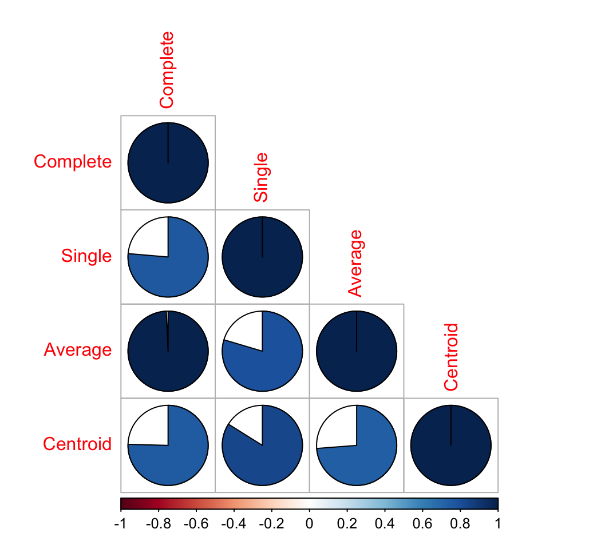

#层次聚类入门

<!-- @import "[TOC]" {cmd:"toc", depthFrom:1, depthTo:6, orderedList:false} -->
<!-- code_chunk_output -->

* [层次聚类入门](#层次聚类入门)
* [1 获取R包](#1-获取r包)
* [2 算法](#2-算法)
* [3 Data preparation and descriptive statistics](#3-data-preparation-and-descriptive-statistics)
* [4 R functions for hierarchical clustering](#4-r-functions-for-hierarchical-clustering)
	* [4.1 hclust() function](#41-hclust-function)
	* [4.2 agnes() and diana() functions](#42-agnes-and-diana-functions)
		* [4.2.1 R code for computing agnes](#421-r-code-for-computing-agnes)
		* [4.2.2 R code for computing diana](#422-r-code-for-computing-diana)
* [7 Hierarchical clustering and correlation based distance](#7-hierarchical-clustering-and-correlation-based-distance)
* [8 What type of distance measures should we choose?](#8-what-type-of-distance-measures-should-we-choose)
	* [9.1 Tanglegram](#91-tanglegram)
	* [9.2 Correlation matrix between a list of dendrogram](#92-correlation-matrix-between-a-list-of-dendrogram)
* [10 Infos](#10-infos)
* [参考](#参考)

<!-- /code_chunk_output -->


原文：[Hierarchical Clustering Essentials - Unsupervised Machine Learning - Easy Guides - Wiki - STHDA]( http://www.sthda.com/english/wiki/hierarchical-clustering-essentials-unsupervised-machine-learning#hclust-function)


有两种标准的聚类策略：划分方法([k-means](http://www.csdn.net/article/2012-07-03/2807073-k-means "深入浅出K-Means算法-CSDN.NET ")和[pam](http://blog.csdn.net/u011955252/article/details/50804918 "文本挖掘之文本聚类算法之PAM（k-中心点） - 红豆和绿豆的博客 - CSDN博客"))和层次聚类【3】。

Hierarchical clustering is an alternative approach to k-means clustering for identifying groups in the dataset. It does not require to pre-specify the number of clusters to be generated. The result is a tree-based representation of the observations which is called a dendrogram. It uses pairwise distance matrix between observations as clustering criteria.
分层集群是在数据集中识别组的k -均值集群的另一种方法。它不需要预先指定要生成的集群的数量。结果是观察的树状表示，称为dendrogram。它将观察到的成对距离矩阵作为聚类标准。

本篇文章中我们将介绍如下内容：

- 描述不同类型的层次聚类算法
- R lab sections with many examples for computing hierarchical clustering, visualizing and comparing dendrogramR实验室中有许多计算层次聚类的例子，可视化和比较树状图
- **系统树状图（dendrogram）**的解释
- 将树状图切割成组的R代码

#1 获取R包

The required packages for this chapter are:

- cluster for computing PAM and CLARA
- factoextra which will be used to visualize clusters
- dendextend for comparing two dendrograms
1. Install factoextra package as follow:
```R
if(!require(devtools)) install.packages("devtools")
devtools::install_github("kassambara/factoextra")
```
2. Install cluster and dendextend packages as follow:
```R
install.packages("cluster")
install.packages("dendextend")
```
3. Load the packages :
```R
library(cluster)
library(dendextend)
library(factoextra)
```
#2 算法

Hierarchical clustering can be divided into two main types: agglomerative and divisive.

Agglomerative clustering: It’s also known as AGNES (Agglomerative Nesting). It works in a bottom-up manner. That is, each object is initially considered as a single-element cluster (leaf). At each step of the algorithm, the two clusters that are the most similar are combined into a new bigger cluster (nodes). This procedure is iterated until all points are member of just one single big cluster (root) (see figure below). The result is a tree which can be plotted as a dendrogram.

Divisive hierarchical clustering: It’s also known as DIANA (Divise Analysis) and it works in a top-down manner. The algorithm is an inverse order of AGNES. It begins with the root, in which all objects are included in a single cluster. At each step of iteration, the most heterogeneous cluster is divided into two. The process is iterated until all objects are in their own cluster (see figure below).

Note that agglomerative clustering is good at identifying small clusters. Divisive hierarchical clustering is good at identifying large clusters.

Hierarchical clustering - AGNES and DIANA

The merging or the division of clusters is performed according some (dis)similarity measure. In R softwrare, the Euclidean distance is used by default to measure the dissimilarity between each pair of observations.

As we already know, it’s easy to compute dissimilarity measure between two pairs of observations. It’s mentioned above that two clusters that are most similar are fused into a new big cluster.

A natural question is :
How to measure the dissimilarity between two clusters of observations?

A number of different cluster agglomeration methods (i.e, linkage methods) has been developed to answer to this question. The most common types methods are:


Maximum or complete linkage clustering: It computes all pairwise dissimilarities between the elements in cluster 1 and the elements in cluster 2, and considers the largest value (i.e., maximum value) of these dissimilarities as the distance between the two clusters. It tends to produce more compact clusters.

Minimum or single linkage clustering: It computes all pairwise dissimilarities between the elements in cluster 1 and the elements in cluster 2, and considers the smallest of these dissimilarities as a linkage criterion. It tends to produce long, “loose” clusters.

Mean or average linkage clustering: It computes all pairwise dissimilarities between the elements in cluster 1 and the elements in cluster 2, and considers the average of these dissimilarities as the distance between the two clusters.

Centroid linkage clustering: It computes the dissimilarity between the centroid for cluster 1 (a mean vector of length p variables) and the centroid for cluster 2.

Ward’s minimum variance method: It minimizes the total within-cluster variance. At each step the pair of clusters with minimum between-cluster distance are merged.


Complete linkage and Ward’s method are generally preferred.

Hierarchical Clustering - Unsupervised Machine LearningHierarchical Clustering - Unsupervised Machine LearningHierarchical Clustering - Unsupervised Machine LearningHierarchical Clustering - Unsupervised Machine Learning

#3 Data preparation and descriptive statistics

We’ll use the built-in R dataset USArrest which contains statistics, in arrests per 100,000 residents for assault, murder, and rape in each of the 50 US states in 1973. It includes also the percent of the population living in urban areas.

It contains 50 observations on 4 variables:

- [,1] Murder numeric Murder arrests (per 100,000)
- [,2] Assault numeric Assault arrests (per 100,000)
- [,3] UrbanPop numeric Percent urban population
- [,4] Rape numeric Rape arrests (per 100,000)

```R
# Load the data set
data("USArrests")
# Remove any missing value (i.e, NA values for not available)
# That might be present in the data
df <- na.omit(USArrests)
# View the firt 6 rows of the data
head(df, n = 6)
##            Murder Assault UrbanPop Rape
## Alabama      13.2     236       58 21.2
## Alaska       10.0     263       48 44.5
## Arizona       8.1     294       80 31.0
## Arkansas      8.8     190       50 19.5
## California    9.0     276       91 40.6
## Colorado      7.9     204       78 38.7
```
Before hierarchical clustering, we can compute some descriptive statistics:

```R
desc_stats <- data.frame(
  Min = apply(df, 2, min), # minimum
  Med = apply(df, 2, median), # median
  Mean = apply(df, 2, mean), # mean
  SD = apply(df, 2, sd), # Standard deviation
  Max = apply(df, 2, max) # Maximum
  )
desc_stats <- round(desc_stats, 1)
head(desc_stats)
##           Min   Med  Mean   SD   Max
## Murder    0.8   7.2   7.8  4.4  17.4
## Assault  45.0 159.0 170.8 83.3 337.0
## UrbanPop 32.0  66.0  65.5 14.5  91.0
## Rape      7.3  20.1  21.2  9.4  46.0
```
Note that the variables have a large different means and variances. This is explained by the fact that the variables are measured in different units; Murder, Rape, and Assault are measured as the number of occurrences per 100 000 people, and UrbanPop is the percentage of the state’s population that lives in an urban area.

They must be standardized (i.e., scaled) to make them comparable. Recall that, standardization consists of transforming the variables such that they have mean zero and standard deviation one. You can read more about standardization in the following article: distance measures and scaling.

As we don’t want the hierarchical clustering result to depend to an arbitrary variable unit, we start by scaling the data using the R function scale() as follow:

```R
df <- scale(df)
head(df)
##                Murder   Assault   UrbanPop         Rape
## Alabama    1.24256408 0.7828393 -0.5209066 -0.003416473
## Alaska     0.50786248 1.1068225 -1.2117642  2.484202941
## Arizona    0.07163341 1.4788032  0.9989801  1.042878388
## Arkansas   0.23234938 0.2308680 -1.0735927 -0.184916602
## California 0.27826823 1.2628144  1.7589234  2.067820292
## Colorado   0.02571456 0.3988593  0.8608085  1.864967207
```
#4 R functions for hierarchical clustering

There are different functions available in R for computing hierarchical clustering. The commonly used functions are:

hclust() [in stats package] and agnes() [in cluster package] for agglomerative hierarchical clustering (HC)
diana() [in cluster package] for divisive HC
##4.1 hclust() function
**hclust()**是stat包内置的R函数，用来计算层次聚类.

简单的使用方式:

```{r}
hclust(d, method = "complete")
```

d a dissimilarity structure as produced by the dist() function.
由**dist()**函数产生的[一种不相似的结构](https://stat.ethz.ch/R-manual/R-devel/library/cluster/html/dissimilarity.object.html "a dissimilarity structure")
method: The agglomeration method to be used. Allowed values is one of “ward.D”, “ward.D2”, “single”, “complete”, “average”, “mcquitty”, “median” or “centroid”.


The dist() function is used to compute the Euclidean distance between observations. Finally, observations are clustered using Ward’s method.

```R
# Dissimilarity matrix
d <- dist(df, method = "euclidean")
# Hierarchical clustering using Ward's method
res.hc <- hclust(d, method = "ward.D2" )
# Plot the obtained dendrogram
plot(res.hc, cex = 0.6, hang = -1)
```

Hierarchical Clustering - Unsupervised Machine Learning

##4.2 agnes() and diana() functions
The R function agnes() [in cluster package] can be also used to compute agglomerative hierarchical clustering. The R function diana() [ in cluster package ] is an example of divisive hierarchical clustering.

```R
# Agglomerative Nesting (Hierarchical Clustering)
agnes(x, metric = "euclidean", stand = FALSE, method = "average")
# DIvisive ANAlysis Clustering
diana(x, metric = "euclidean", stand = FALSE)
```

x: data matrix or data frame or dissimilarity matrix. In case of matrix and data frame, rows are observations and columns are variables. In case of a dissimilarity matrix, x is typically the output of daisy() or dist().
metric: the metric to be used for calculating dissimilarities between observations. Possible values are “euclidean” and “manhattan”.
stand: if TRUE, then the measurements in x are standardized before calculating the dissimilarities. Measurements are standardized for each variable (column), by subtracting the variable’s mean value and dividing by the variable’s mean absolute deviation
method: The clustering method. Possible values includes “average”, “single”, “complete”, “ward”.


The function agnes() returns an object of class “agnes” (see ?agnes.object) which has methods for the functions: print(), summary(), plot(), pltree(), as.dendrogram(), as.hclust() and cutree().
The function diana() returns an object of class “diana” (see ?diana.object) which has also methods for the functions: print(), summary(), plot(), pltree(), as.dendrogram(), as.hclust() and cutree().
Compared to other agglomerative clustering methods such as hclust(), agnes() has the following features:

It yields the agglomerative coefficient (see agnes.object) which measures the amount of clustering structure found
Apart from the usual tree it also provides the banner, a novel graphical display (see plot.agnes).
###4.2.1 R code for computing agnes
```R
library("cluster")
# Compute agnes()
res.agnes <- agnes(df, method = "ward")
# Agglomerative coefficient
res.agnes$ac
## [1] 0.934621
# Plot the tree using pltree()
pltree(res.agnes, cex = 0.6, hang = -1,
       main = "Dendrogram of agnes") 
```
Hierarchical Clustering - Unsupervised Machine Learning

It’s also possible to draw AGNES dendrogram using the function plot.hclust() and the function plot.dendrogram() as follow:

```R
# plot.hclust()
plot(as.hclust(res.agnes), cex = 0.6, hang = -1)
# plot.dendrogram()
plot(as.dendrogram(res.agnes), cex = 0.6, 
     horiz = TRUE)
```
###4.2.2 R code for computing diana

```R
# Compute diana()
res.diana <- diana(df)
# Plot the tree
pltree(res.diana, cex = 0.6, hang = -1,
       main = "Dendrogram of diana")
```
Hierarchical Clustering - Unsupervised Machine Learning
```R
# Divise coefficient; amount of clustering structure found
res.diana$dc
## [1] 0.8514345
```
As for plotting AGNES dendrogram, the functions plot.hclust() and plot.dendrogram() can be used as follow:
```R
# plot.hclust()
plot(as.hclust(res.diana), cex = 0.6, hang = -1)
# plot.dendrogram()
plot(as.dendrogram(res.diana), cex = 0.6, 
     horiz = TRUE)
5 Interpretation of the dendrogram
```
In the dendrogram displayed above, each leaf corresponds to one observation. As we move up the tree, observations that are similar to each other are combined into branches, which are themselves fused at a higher height.

The height of the fusion, provided on the vertical axis, indicates the (dis)similarity between two observations. The higher the height of the fusion, the less similar the observations are.

Note that, conclusions about the proximity of two observations can be drawn only based on the height where branches containing those two observations first are fused. We cannot use the proximity of two observations along the horizontal axis as a criteria of their similarity.

In order to identify sub-groups (i.e. clusters), we can cut the dendrogram at a certain height as described in the next section.

6 Cut the dendrogram into different groups

The height of the cut to the dendrogram controls the number of clusters obtained. It plays the same role as the k in k-means clustering.

The function cutree() is used and it returns a vector containing the cluster number of each observation:

```R
# Cut tree into 4 groups
grp <- cutree(res.hc, k = 4)
# Number of members in each cluster
table(grp)
## grp
##  1  2  3  4 
##  7 12 19 12
# Get the names for the members of cluster 1
rownames(df)[grp == 1]
## [1] "Alabama"        "Georgia"        "Louisiana"      "Mississippi"   
## [5] "North Carolina" "South Carolina" "Tennessee"
```
It’s also possible to draw the dendrogram with a border around the 4 clusters. The argument border is used to specify the border colors for the rectangles:

plot(res.hc, cex = 0.6)
rect.hclust(res.hc, k = 4, border = 2:5)
Hierarchical Clustering - Unsupervised Machine Learning

Using the function fviz_cluster() [in factoextra], we can also visualize the result in a scatter plot. Observations are represented by points in the plot, using principal components. A frame is drawn around each cluster.

library(factoextra)
fviz_cluster(list(data = df, cluster = grp))
Hierarchical Clustering - Unsupervised Machine Learning

The function cutree() can be used also to cut the tree generated with agnes() and diana() as follow:

```R
# Cut agnes() tree into 4 groups
cutree(res.agnes, k = 4)
# Cut diana() tree into 4 groups
cutree(as.hclust(res.diana), k = 4)
```
#7 Hierarchical clustering and correlation based distance

The different functions for hierarchical clustering use Euclidean distance measures as default metric. It’s also possible to use correlation-based distance measures. Firstly, pairwise correlation matrix between items is computed using the function cor() which can calculate either “pearson”, “spearman” or “kendall” correlation method. Next, the correlation matrix is converted as a distance matrix and finally clustering can be computed on the resulting distance matrix.

```R
res.cor <- cor(t(df), method = "pearson")
d.cor <- as.dist(1 - res.cor)
plot(hclust(d.cor, method = "ward.D2"), cex = 0.6)
```
Hierarchical Clustering - Unsupervised Machine Learning

#8 What type of distance measures should we choose?

The choice of dissimilarity measures is very important, as it has a strong influence on the resulting dendrogram.

In many of the examples described above, we used Euclidean distance as the dissimilarity measure. Depending on the type of the data and the researcher questions, other dissimilarity measures might be preferred such as correlation-based distance.

Correlation-based distance considers two observations to be similar if their features are highly correlated, even though the observed values may be far apart in terms of Euclidean distance.

If we want to identify clusters of observations with the same overall profiles regardless of their magnitudes, then we should go with correlation-based distance as a dissimilarity measure. This is particularly the case in gene expression data analysis, where we might want to consider genes similar when they are “up” and “down” together. It is also the case, in marketing if we want to identify group of shoppers with the same preference in term of items, regardless of the volume of items they bought.

If Euclidean distance is chosen, then observations with high values of features will be clustered together. The same holds true for observations with low values of features.


Note that, when the data are standardized, there is a functional relationship between the Pearson correlation coefficient r(x,y)r(x,y) and the Euclidean distance.

With some maths, the relationship can be defined as follow:

deuc(x,y)=2m[1−r(x,y)]−−−−−−−−−−−−√
deuc(x,y)=2m[1−r(x,y)]

Where x and y are two standardized m-vectors with zero mean and unit length.

For example, the standard k-means clustering uses the Euclidean distance measure. So, If you want to compute K-means using correlation distance, you just have to normalize the points before clustering.


9 Comparing two dendrograms

We’ll use the package dendextend which contains many functions for comparing two dendrograms, including: dend_diff(), tanglegram(), entanglement(), all.equal.dendrogram(), cor.dendlist().

The function tanglegram() and cor.dendlist() are described in this section.

A random subset of the dataset will be used in the following example. The function sample() is used to randomly select 10 observations among the 50 observations contained in the data set

```R
# Subset containing 10 rows
set.seed(123)
ss <- sample(1:50, 10)
df <- df[ss,]
```
In the R code below, we’ll start by computing pairwise distance matrix using the function dist(). Next, hierarchical clustering (HC) is computed using two different linkage methods (“average” and “ward.D2”). Finally the results of HC are transformed as dendrograms:

```R
library(dendextend)
# Compute distance matrix
res.dist <- dist(df, method = "euclidean")
# Compute 2 hierarchical clusterings
hc1 <- hclust(res.dist, method = "average")
hc2 <- hclust(res.dist, method = "ward.D2")
# Create two dendrograms
dend1 <- as.dendrogram (hc1)
dend2 <- as.dendrogram (hc2)
# Create a list of dendrograms
dend_list <- dendlist(dend1, dend2)
```
##9.1 Tanglegram
The function tanglegram() plots two dendrograms, side by side, with their labels connected by lines. It can be used for visually comparing two methods of Hierarchical clustering as follow:

```R
tanglegram(dend1, dend2)
```
Hierarchical Clustering - Unsupervised Machine Learning

Note that “unique” nodes, with a combination of labels/items not present in the other tree, are highlighted with dashed lines.

The quality of the alignment of the two trees can be measured using the function entanglement(). The output of tanglegram() can be customized using many other options as follow:

```R
tanglegram(dend1, dend2,
  highlight_distinct_edges = FALSE, # Turn-off dashed lines
  common_subtrees_color_lines = FALSE, # Turn-off line colors
  common_subtrees_color_branches = TRUE, # Color common branches 
  main = paste("entanglement =", round(entanglement(dend_list), 2))
  )
```
Hierarchical Clustering - Unsupervised Machine Learning

Entanglement is a measure between 1 (full entanglement) and 0 (no entanglement). A lower entanglement coefficient corresponds to a good alignment

##9.2 Correlation matrix between a list of dendrogram
The function cor.dendlist() is used to compute “Baker” or “Cophenetic” correlation matrix between a list of trees.

```R
# Cophenetic correlation matrix
cor.dendlist(dend_list, method = "cophenetic")
##           [,1]      [,2]
## [1,] 1.0000000 0.9646883
## [2,] 0.9646883 1.0000000
# Baker correlation matrix
cor.dendlist(dend_list, method = "baker")
##           [,1]      [,2]
## [1,] 1.0000000 0.9622885
## [2,] 0.9622885 1.0000000
```
The correlation between two trees can be also computed as follow:

```R
# Cophenetic correlation coefficient
cor_cophenetic(dend1, dend2)
## [1] 0.9646883
# Baker correlation coefficient
cor_bakers_gamma(dend1, dend2)
## [1] 0.9622885
```
It’s also possible to compare simultaneously multiple dendrograms. A chaining operator %>% (available in dendextend) is used to run multiple function at the same time. It’s useful for simplifying the code:

```R
# Subset data
set.seed(123)
ss <- sample(1:150, 10 )
# Create multiple dendrograms by chaining
dend1 <- df %>% dist %>% hclust("com") %>% as.dendrogram
dend2 <- df %>% dist %>% hclust("single") %>% as.dendrogram
dend3 <- df %>% dist %>% hclust("ave") %>% as.dendrogram
dend4 <- df %>% dist %>% hclust("centroid") %>% as.dendrogram
# Compute correlation matrix
dend_list <- dendlist("Complete" = dend1, "Single" = dend2,
                      "Average" = dend3, "Centroid" = dend4)
cors <- cor.dendlist(dend_list)
# Print correlation matrix
round(cors, 2)
##          Complete Single Average Centroid
## Complete     1.00   0.76    0.99     0.75
## Single       0.76   1.00    0.80     0.84
## Average      0.99   0.80    1.00     0.74
## Centroid     0.75   0.84    0.74     1.00
# Visualize the correlation matrix using corrplot package
library(corrplot)
corrplot(cors, "pie", "lower")
```



#10 Infos

This analysis has been performed using R software (ver. 3.2.1)

#参考

1. [Data Mining Algorithms In R/Clustering/Dissimilarity Matrix Calculation - Wikibooks, open books for an open world](https://en.wikibooks.org/wiki/Data_Mining_Algorithms_In_R/Clustering/Dissimilarity_Matrix_Calculation)
2. 周志华. 机器学习 : = Machine learning[M]. 清华大学出版社, 2016.
3. JIAWEI HAN MICHELINE KAMBER. 数据挖掘概念与技术(原书第2版)(计算机科学丛书)[M]. 机械工业出版社, 2008.