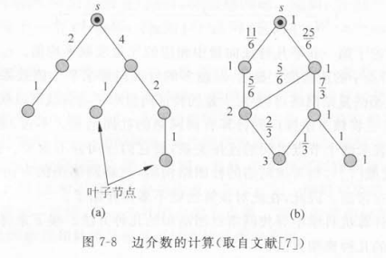
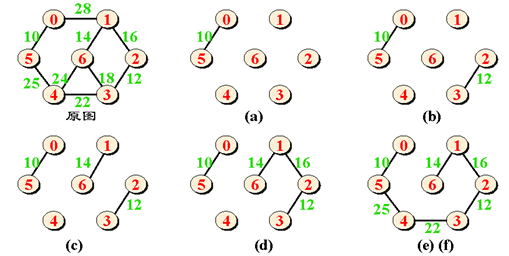
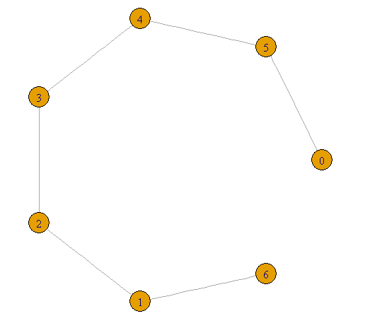
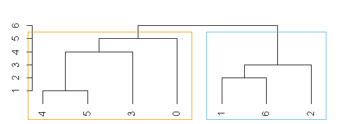
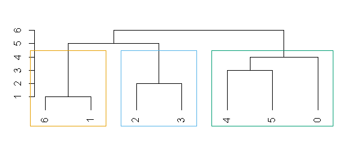
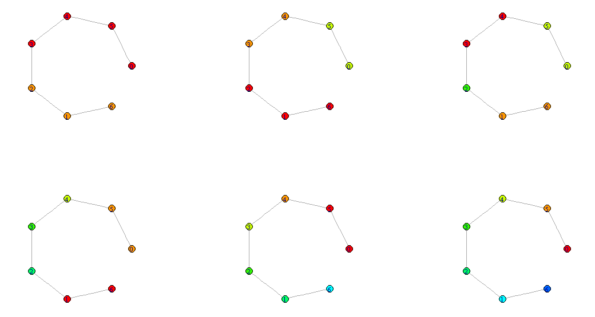
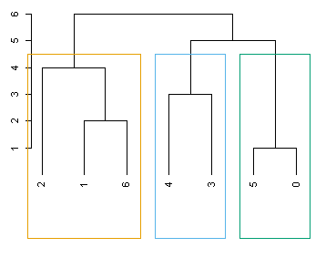

7 复杂网络中的社图结构


<!-- @import "[TOC]" {cmd="toc" depthFrom=1 depthTo=6 orderedList=false} -->
<!-- code_chunk_output -->

* [7.1 引言](#71-引言)
* [7.4 分裂方法](#74-分裂方法)
	* [基本思想](#基本思想)
	* [GN算法的实现](#gn算法的实现)
		* [广度优先算法](#广度优先算法)
* [7.5 凝聚算法](#75-凝聚算法)
	* [7.5.1 Newman快速算法](#751-newman快速算法)
		* [R代码实例](#r代码实例)
		* [java代码实例](#java代码实例)

<!-- /code_chunk_output -->


# 7.1 引言

整个网络是由若干个“群（group）”或“团（cluster）”构成的。每个群内部的节点之间的链接相对非常紧密，但是各个群之间的链接相对来说去比较稀疏。

网络社团结构的研究与社会学中的分级聚类（hierarchical clustering）有着密切的关系。

分级聚类是寻找社会网络中社图结构的一类传统算法。它是基于各个节点之间连接的相似性或者强度，把网络自然的划分为各个子群。根据往网络中添加边还是从网络中移除边， 该类算法又可以分为两类：凝聚方法（agglomerative method）和分裂方法（divisive method）。

# 7.4 分裂方法

## 基本思想

前面已经提到，根据网络中添加边还是从网络中移除边，可以把社会学中分级聚类的一套方法分为两大类：凝聚方法和分裂方法。GN方法就是一种分裂方法。它的基本思想是不断地从网络中移除介数（Betweenness）最大的边。边介数定义为网络中经过每条边的最短路径的数目。

GN算法的基本流程如下：
1. 计算网络中所有边的介数；
2. 找到介数最高的边并将它从网络中移除；
3. 重复步骤2，直到每个节点就是一个退化的社团为止。

## GN算法的实现

假设一个图的节点数为n，边数为m。每进行一次广度优先搜索就可以得到一个节点与其他各节点间的所有的最短路径，且算法复杂度为O(m)。



首先，找到这颗树不被任何其他节点访问的叶节点，将于叶节点相连的边赋值为1。
然后，从离数的源节点距离最远的一条边开始，逐步上移，依次为每条边赋值，其值为紧接在该边下的所有邻边的值之和再加1。
对所有可能的源节点重复这个过程。


### 广度优先算法

kruskal





```R
library(igraph)
g <- graph.formula(0-5,5-4,4-3,3-2,2-1,1-6)
V(g)
E(g)
ecount(g)
is.weighted(g)
wg <- g
E(wg)$weight <- c(10,25,22,12,16,14)
E(wg)$weight
degree(wg)
neighbors(wg,5)
plot(wg,layout=layout.circle)

```



```R
> kc <- fastgreedy.community(wg)
> membership(kc)
0 5 4 3 2 1 6 
1 1 1 1 2 2 2 
> library(ape)
> dendPlot(kc, mode="hclust")
```




```r
> plot(wg,layout=layout.circle)
> betweenness(wg)
0 5 4 3 2 1 6 
0 5 8 9 8 5 0 
> E(wg)
+ 6/6 edges (vertex names):
[1] 0--5 5--4 4--3 3--2 2--1 1--6
> edge.betweenness(wg)
[1]  6 10 12 12 10  6
> ebc <- edge.betweenness.community(g)
> membership(ebc)
0 5 4 3 2 1 6 
1 1 1 2 2 3 3 
> dendPlot(ebc, mode="hclust")
```


* [r - edge betweenness community cut off point - Stack Overflow ](https://stackoverflow.com/questions/24715788/edge-betweenness-community-cut-off-point)

查看划分的步骤

```r
cut <- cutat(ebc,4)
colors <- rainbow(4)
plot(wg, vertex.color=colors[cut],layout=layout.circle)
```


# 7.5 凝聚算法

## 7.5.1 Newman快速算法

Newman快速算法实际上是基于贪婪算法思想的一种凝聚算法【1】。贪婪算法是一种在每一步选择中都采取在当前状态下最好或最优（即最有利）的选择，从而希望导致结果是最好或最优的算法【2】。社区发现（Community Detection）算法用来发现网络中的社区结构，也可以视为一种广义的聚类算法【4】。基于模块度优化的社团发现算法是目前研究最多的一类算法，由Newman等首先提出模块度Q 值是目前使用最广泛的优化目标【3】。Newman算法可以用于分析节点数达100万的复杂网络【1】
 
Newman快速算法将每个节点看作是一个社团，每次迭代选择产生最大Q值的两个社团合并，直至整个网络融合成一个社团。整个过程可表示成一个树状图，从中选择Ｑ值最大的层次划分得到最终的社团结构。该算法的总体时间复杂度为Ｏ（ｍ（ｍ＋ｎ））【3】。

1. 初始化网络为n个社团，即每个节点就是一个独立社团。初始的$e_{ij}$和$a_i$满足：

$ e_{ij} = \begin{cases} 1/2m, &\text{如果节点i和j之间有边相连}  \\ 0, &\text{其他}  \end{cases} $

$ a_i = k_i/2m $

其中，$k_i$为节点i的度；m为网络中总的边数。

2. 依次合并有边相连的社团对，并计算合并后的模块度增量

$ \vartriangle Q = e_{ij} + e_{ji} - 2a_i*a_j = 2(e_{ij} - a_i*a_j) $

根据贪婪算法的原理，每次来合并应该沿着使Q增大最多或者减少最小的方向进行。该步的算法复杂度为$ O(m) $。每次合并以后，对相应的元素$ e_{ij} $更新，并将于`i, j`社团相关的行和列相加。该步的算法复杂度为$ O(n) $。因此，第二步的总的算法复杂度为$ O(m+n) $。


* Clauset A, Newman M E, Moore C. Finding community structure in very large networks[J]. Physical Review E Statistical Nonlinear & Soft Matter Physics, 2004, 70(2):066111.

$ A_{ij} = \begin{cases} 1, &\text{如果节点v和节点w相连}  \\ 0, &\text{其他}  \end{cases} $

节点v所在的社团表示为$ c_v $，节点w所在的社团表示为$ c_w $，

$ \delta(c_v, c_w) = \begin{cases} 1, &\text{如果节点v和节点w在同一社团} \\ 0,  &\text{其他}   \end{cases} $ 

相同社区的度占整个图的度的比例

$$ \frac
     {\sum_{vw}A_{vw}\delta(c_v, c_w)}
     {\sum_{vw}A_{vw}}
       = \frac
           {1}
           {2m}
             \sum_{vw}A_{vw}\delta(c_v, c_w)
$$

节点的度$ k_v = \sum_{w}A_{vw} $

图中所有的边$ m = \frac{1}{2}\sum_{vw}A_{vw} $。由于是无向图，边的数量是度的数量的$ 1/2 $，包含入度和出度。

顶点v和w之间存在边的概率，连接是随机的，但期望值是$ {k_{v} k_{w}}/{2m} $。

$$
Q = \frac{1}{2m}\displaystyle\sum_{vw}
    \begin{bmatrix}
       A_{vw} - \frac
                  {k_{v} k_{w}}
                  {2m}
    \end{bmatrix}
    \delta(c_v, c_w)
$$


简化的公式

模块度$ Q = \displaystyle\sum_{i}(e_{ii} - a_{i}^2) $

0.3标志良好的重要性

* 李晓佳, 张鹏, 狄增如,等. 复杂网络中的社团结构[J]. 复杂系统与复杂性科学, 2008, 5(3):19-42.

模块化是指，网络中连接社团结构内部顶点的边所占的比例，与另外一个随机网络中连接社团结构内部顶点的边所占比例的期望值，相减得到的差值。

### R代码实例




```r
library(igraph)
library(ape)
g <- graph.formula(0-5,5-4,4-3,3-2,2-1,1-6)
par(mfrow=c(2,3))
colors <- rainbow(10)
fc <- fastgreedy.community(g)
plot(g, vertex.color=colors[cutat(fc,2)],layout=layout.circle)
plot(g, vertex.color=colors[cutat(fc,3)],layout=layout.circle)
plot(g, vertex.color=colors[cutat(fc,4)],layout=layout.circle)
plot(g, vertex.color=colors[cutat(fc,5)],layout=layout.circle)
plot(g, vertex.color=colors[cutat(fc,6)],layout=layout.circle)
plot(g, vertex.color=colors[cutat(fc,7)],layout=layout.circle)
dendPlot(fc, mode="hclust")
d <- as.dendrogram(fc)

#模拟计算
dg <- degree(g)
(1-(dg[[1]]*dg[[2]]))/ecount(g)
(0-(dg[[1]]*dg[[3]]))/ecount(g)
(0-(dg[[1]]*dg[[4]]))/ecount(g)
(0-(dg[[1]]*dg[[5]]))/ecount(g)
(0-(dg[[1]]*dg[[6]]))/ecount(g)
(0-(dg[[1]]*dg[[7]]))/ecount(g)
(1-(dg[[2]]*dg[[3]]))/ecount(g)
(1-(dg[[2]]*dg[[4]]))/ecount(g)

c <- 0
m <- c()
am <- get.adjacency(g)
mm <- as.matrix(am)
for(i in 1:7){
	for(j in 1:7){
		c <- c+1
		m[c] <- (mm[i,j]-(dg[[i]]*dg[[j]]))/ecount(g)
		print (paste(i," -> ",j,(1-(dg[[i]]*dg[[j]]))/ecount(g)," num[",c,"]"))
	}
}
m
matrix(m,nrow=7,col=7,byrow=T)
```


* [xdata-igraph/test_fastgreedy.community.R at develop · igraph/xdata-igraph ](https://github.com/igraph/xdata-igraph/blob/develop/interfaces/R/igraph/inst/tests/test_fastgreedy.community.R)

```r
context("fastgreedy.community")

test_that("fastgreedy.community works", {

  library(igraph)
  set.seed(42)

  g <- graph.famous("Zachary")
  fc <- fastgreedy.community(g)

  expect_that(modularity(g, fc$membership), equals(max(fc$modularity)))
  expect_that(membership(fc), equals(c(1, 3, 3, 3, 1, 1, 1, 3, 2, 3,
                                       1, 1, 3, 3, 2, 2, 1, 3, 2, 1,
                                       2, 3, 2, 2, 2, 2, 2, 2, 2, 2,
                                       2, 2, 2, 2)))
  expect_that(length(fc), equals(3))
  expect_that(as.numeric(sizes(fc)), equals(c(8, 17, 9)))

  d <- as.dendrogram(fc)
  expect_that(print(d), prints_text("2 branches.*34 members.*height 33"))
  expect_that(print(d[[1]]),
              prints_text("2 branches.*17 members.*height 32"))
  expect_that(print(d[[2]]),
              prints_text("2 branches.*17 members.*height 30"))
  m2 <- cutat(fc, no=3)
  expect_that(modularity(g, m2),
              equals(fc$modularity[length(fc$modularity)-2]))
})
```


* [igraph Reference Manual ](http://igraph.org/c/doc/igraph-Community.html#igraph_community_walktrap)

Pointer to a matrix, the merges performed by the algorithm will be stored here (if not NULL). Each merge is a row in a two-column matrix and contains the ids of the merged clusters. Clusters are numbered from zero and cluster numbers smaller than the number of nodes in the network belong to the individual vertices as singleton clusters. In each step a new cluster is created from two other clusters and its id will be one larger than the largest cluster id so far. This means that before the first merge we have n clusters (the number of vertices in the graph) numbered from zero to n-1. The first merge creates cluster n, the second cluster n+1, etc.
指向矩阵的指针，merge算法执行的结果将存储在这里（如果不是NULL）。每个merge是具有两个列的矩阵的一行。这个矩阵包含合并后的集群的ID。集群从零开始编号。小于网络中节点数的簇数作为单个集群属于单个顶点。在每一步中，都会从另外两个集群创建一个新的集群。其ID将比目前最大的集群ID大一个。这意味着在第一个合并之前，我们有n个簇（图中顶点的数目）从0到n-1。第一个merge创建集群n，第二创建集群n+1，等等。

### java代码实例

* [526536686/Fast-Newman-Algorithm: `This algorithm's idea comes from <Fast algorithm for detecting community structure in networks>` ](https://github.com/526536686/Fast-Newman-Algorithm)


参考
1. [汪小帆. 复杂网络理论及其应用[M]. 清华大学出版社, 2006. P184 ~185](books.google.com.hk/books?id=IMzxW0XiuDQC&pg=PA185&lpg=PA185&dq=Newman%E5%BF%AB%E9%80%9F%E7%AE%97%E6%B3%95&source=bl&ots=fvl3jgHdIz&sig=hGR-_8bH0ZklUkWWbtLra8geFDY&hl=zh-CN&sa=X&ved=0ahUKEwizjebkvYLVAhVGUZQKHWneCUUQ6AEILDAB#v=onepage&q=Newman%E5%BF%AB%E9%80%9F%E7%AE%97%E6%B3%95&f=false)
2. [贪心法 - 维基百科，自由的百科全书](zh.wikipedia.org/wiki/%E8%B4%AA%E5%BF%83%E6%B3%95)
3. [骆志刚, 丁凡, 蒋晓舟,等. 复杂网络社团发现算法研究新进展[J]. 国防科技大学学报, 2011, 33(1):47-52.
](journal.nudt.edu.cn/publish_article/2011/1/201101011.pdf)
4. [Community Detection 算法 - peghoty - CSDN博客 ](http://blog.csdn.net/itplus/article/details/9286905)
5. [模块度(Modularity)与Fast Newman算法讲解与代码实现 - 博客频道 - CSDN.NET ](blog.csdn.net/marywbrown/article/details/62059231)
6. [科学网—Girvan-Newman社群发现算法 - 毛进的博文 ](http://blog.sciencenet.cn/blog-563898-750516.html)
7. [模块度 - 维基百科，自由的百科全书 ](https://zh.wikipedia.org/wiki/%E6%A8%A1%E5%9D%97%E5%BA%A6)
8. [Markdown中插入数学公式的方法 - xiahouzuoxin - CSDN博客](http://blog.csdn.net/xiahouzuoxin/article/details/26478179) 
9. [Kumar R, Moseley B, Vassilvitskii S, et al. Fast greedy algorithms in mapreduce and streaming[C]// ACM Symposium on Parallelism in Algorithms and Architectures. ACM, 2013:1-10.](http://cseweb.ucsd.edu/~avattani/papers/mrgreedy.pdf)
