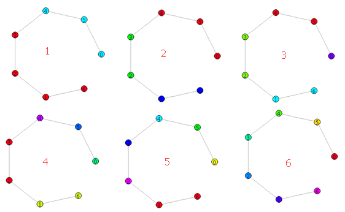

图处理：rigraph实现边介数社区发现算法(GN)


<!-- @import "[TOC]" {cmd="toc" depthFrom=1 depthTo=6 orderedList=false} -->
<!-- code_chunk_output -->

* [节点介数和边介数](#节点介数和边介数)
* [rigraph实现](#rigraph实现)
* [边介数的计算](#边介数的计算)

<!-- /code_chunk_output -->


按照边介数来划分社区是个有趣的话题。根据rigraph可以轻松的实现这一功能，更详细的内容请参考[edge.betweenness.community](https://www.rdocumentation.org/packages/igraph/versions/0.7.1/topics/edge.betweenness.community) 。

# 节点介数和边介数

节点介数已在[图处理：使用graphstream来计算无向图的介数中心性](http://blog.csdn.net/sinkou/article/details/75688790)一文中，有浅显的介绍。就不在这里重复了，而边介数参考[betweenness - igraph](http://igraph.org/r/doc/betweenness.html)和[edge_betweenness_centrality — NetworkX ](https://networkx.github.io/documentation/networkx-1.10/reference/generated/networkx.algorithms.centrality.edge_betweenness_centrality.html)。

参考：

[1]. [A Faster Algorithm for Betweenness Centrality. Ulrik Brandes, Journal of Mathematical Sociology 25(2):163-177, 2001. ](http://www.inf.uni-konstanz.de/algo/publications/b-fabc-01.pdf)
[2]. [Ulrik Brandes: On Variants of Shortest-Path Betweenness Centrality and their Generic Computation. Social Networks 30(2):136-145, 2008.](http://www.inf.uni-konstanz.de/algo/publications/b-vspbc-08.pdf)

在节点的最短路径中，边介数是通过边E的总和

$c_B(e) =\sum_{s,t \in V} \frac{\sigma(s, t|e)}{\sigma(s, t)}$

其中V是节点的集合，$\sigma(s, t)$是节点(s，t)之间最短路径的个数。$ \sigma(s, t|e)$节点(s，t)之间，通过边`e`的，最短路径的个数[2]。


# rigraph实现

喜欢python的同学可以使用[networkx](ttps://networkx.github.io/documentation/networkx-1.10/reference/generated/networkx.algorithms.centrality.edge_betweenness_centrality.html)。这里将列出rigraph的实现

```R
> library(igraph)
> g <- graph.formula(0-5,5-4,4-3,3-2,2-1,1-6)
> V(g)
> E(g)
> ecount(g)
> is.weighted(g)
> ebc <- edge.betweenness.community(g)
> library(ape)
> membership(ebc)
0 5 4 3 2 1 6 
1 1 1 2 2 3 3 
> dendPlot(ebc, mode="hclust")
```

<!--  -->
)

# 边介数的计算

参考：
1. M Newman and M Girvan: Finding and evaluating community structure in networks, Physical Review E 69, 026113 (2004)
2. [r - edge betweenness community cut off point - Stack Overflow ](https://stackoverflow.com/questions/24715788/edge-betweenness-community-cut-off-point)
3. 汪小帆. 复杂网络理论及其应用[M]. 清华大学出版社, 2006.

边介数的公式[1]，初学是有点难于理解。

$c_B(e) =\sum_{s,t \in V} \frac{\sigma(s, t|e)}{\sigma(s, t)}$

其实，[edge.betweenness.community](https://www.rdocumentation.org/packages/igraph/versions/0.7.1/topics/edge.betweenness.community) 是Girvan和Newman（GN）提供算法的一种实现。GN方法就是一种分裂方法。它的基本思想是不断地从网络中移除介数（Betweenness）最大的边。边介数定义为网络中经过每条边的最短路径的数目[3]。

GN算法的基本流程如下：
1. 计算网络中所有边的介数；
2. 找到介数最高的边并将它从网络中移除；
3. 重复步骤2，直到每个节点就是一个退化的社团为止。

下面，将步骤减慢一步一步的分解[2]。

```r
> g <- graph.formula(0-5,5-4,4-3,3-2,2-1,1-6)
> edge.betweenness(g)
[1]  6 10 12 12 10  6
#12最大，去掉4-3这条边
> edge.betweenness(graph.formula(0-5,5-4,3-2,2-1,1-6))
[1] 2 2 3 4 3
#4最大，去掉2-1这条边
> edge.betweenness(graph.formula(0-5,5-4,3-2,1-6))
[1] 2 2 1 1
#2最大，去掉0-5这条边
> edge.betweenness(graph.formula(5-4,3-2,1-6))
[1] 1 1 1
#1最大，去掉5-4这条边
> edge.betweenness(graph.formula(3-2,1-6))
[1] 1 1
#1最大，去掉3-2这条边
> edge.betweenness(graph.formula(1-6))
[1] 1
```

<!--  -->
