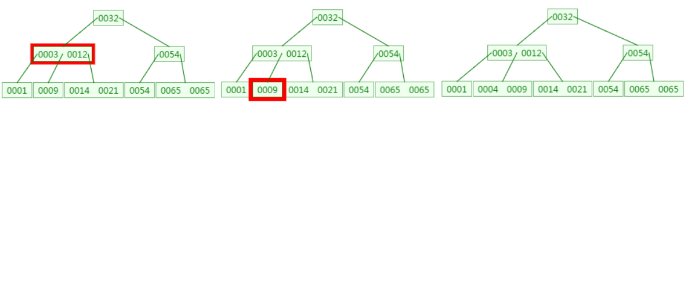
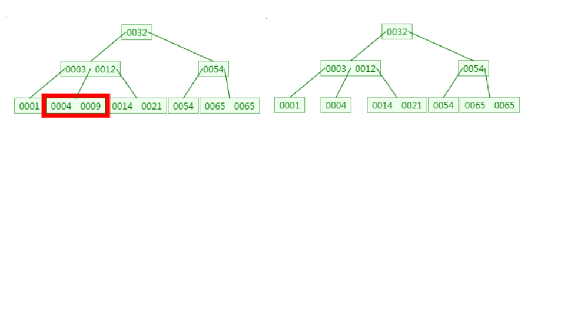

# 0. 参考
1. 什么是B-Tree - 冬瓜蔡 - 博客园 https://www.cnblogs.com/dongguacai/p/7239599.html
2. [【经典数据结构】B树与B+树](https://www.cnblogs.com/vincently/p/4526560.html)

B-Tree就是我们常说的B树。B树这种数据结构常常用于实现数据库索引，因为它的查找效率比较高。

# 1. 磁盘IO与预读
1. 磁盘IO
    1. 磁盘读取依靠的是机械运动，分为寻道时间、旋转延迟、传输时间三个部分，这三个部分耗时相加就是一次磁盘IO的时间，大概9ms左右
    2. 这个成本是访问内存的十万倍左右
2. 预读
    1. 每一次IO时，不仅仅把当前磁盘地址的数据加载到内存，同时也把相邻数据也加载到内存缓冲区中
    2. 局部预读原理：当访问一个地址数据的时候，与其相邻的数据很快也会被访问到
    3. 每次磁盘IO读取的数据我们称之为一页（page）。一页的大小与操作系统有关，一般为4k或者8k。这也就意味着读取一页内数据的时候，实际上发生了一次磁盘IO。

# 2. B-Tree与二叉查找树的对比
　　
1. 二叉查找树查询的时间复杂度是O（logN），查找速度最快和比较次数最少，既然性能已经如此优秀，但为什么实现索引是使用B-Tree而不是二叉查找树
    1. 关键因素是`磁盘IO的次数`。
    2. 数据库索引是存储在磁盘上，当表中的数据量比较大时，索引的大小也跟着增长，达到几个G甚至更多
    3. 当我们利用索引进行查询的时候，不可能把索引全部加载到内存中，只能逐一加载每个磁盘页，这里的磁盘页就对应索引树的节点。

# 3. 二叉树
1. 先来看二叉树查找时磁盘IO的次：定义一个树高为4的二叉树，查找值为10：
    1. 
    2. 从二叉树的查找过程了来看，树的高度和磁盘IO的次数都是4，所以最坏的情况下`磁盘IO的次数由树的高度来决定`。
    3. 从前面分析情况来看，`减少磁盘IO的次数就必须要压缩树的高度，让瘦高的树尽量变成矮胖的树`，所以B-Tree就在这样伟大的时代背景下诞生了。

# 4. B-Tree

1. m阶B-Tree满足以下条件：
    1. 每个节点最多拥有m个子树
    2. 根节点至少有2个子树
    3. 分支节点至少拥有m/2颗子树（除根节点和叶子节点外都是分支节点）
    4. 所有叶子节点都在同一层、每个节点最多可以有m-1个key，并且以升序排列
2. B树查找
    1. 
    2. 从查找过程中发现，B树的比对次数和磁盘IO的次数与二叉树相差不了多少，所以这样看来并没有什么优势。
    3. 但是仔细一看会发现，`比对是在内存中完成中，不涉及到磁盘IO`，耗时可以忽略不计。另外B树种一个节点中可以存放很多的key（个数由树阶决定）。
    4. 相同数量的key在B树中生成的节点要远远少于二叉树中的节点，相差的节点数量就等同于磁盘IO的次数。这样到达一定数量后，性能的差异就显现出来了。
3. B树的新增：在刚才的基础上新增元素4，它应该在3与9之间：
    1. 
4. B树的删除：删除元素9：
    1. 
5. M=4 阶的B树
    1. 下面是往B树中依次插入
        1. 6 10 4 14 5 11 15 3 2 12 1 7 8 8 6 3 6 21 5 15 15 6 32 23 45 65 7 8 6 5 4
        2. 

# 5. 总结

插入或者删除元素都会导致节点发生裂变反应，有时候会非常麻烦，但正因为如此才让B树能够始终保持多路平衡，这也是`B树自身的一个优势：自平衡`；B树主要应用于文件系统以及部分数据库索引，如MongoDB，大部分关系型数据库索引则是使用B+树实现。