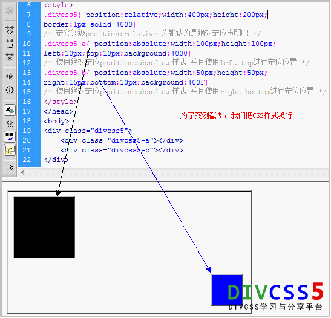

* [CSS position绝对定位absolute relative - DIVCSS5 ](http://www.divcss5.com/rumen/r403.shtml)

position语法： 
position : static absolute relative 

position参数：
static : 　无特殊定位，对象遵循HTML定位规则
absolute : 　将对象从文档流中拖出，使用left，right，top，bottom等属性进行绝对定位。而其层叠通过css z-index属性定义。此时对象不具有边距，但仍有补白和边框
relative : 　对象不可层叠，但将依据left，right，top，bottom等属性在正常文档流中偏移位置

> 绝对定位与float浮动不能同时使用

# 绝对定位使用条件

position:absolute；position:relative绝对定位使用通常是父级定义position:relative定位，子级定义position:absolute绝对定位属性，并且子级使用left或right和top或bottom进行绝对定位。
```css
/*定义，通常最好再定义CSS宽度和CSS高度*/
.divcss5{position:relative} 
 /*这里定义了距离父级左侧距离间距为10px，距离父级上边距离为10px*/
.divcss5-a{position:absolute;left:10px;top:10px}
/*或 这里定义了距离父级靠右距离10px,距离父级靠下边距离为10px*/
.divcss5-a{position:absolute;right:10px;bottom:10px}
```
对应HTML结构
```html
<div class="divcss5">
    <div class="divcss5-a"></div>
</div>
```
这样就绝对定位了“divcss5-a”在父级“divcss5”盒子内。
注意的是，left（左）和right（右）在一个对象只能选一种定义，bottom（下）和top（上）也是在一个对象只能选一种定义。

