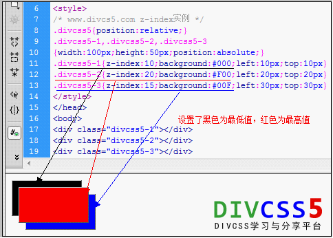

* [css z-index层重叠顺序 - DIVCSS5 ](http://www.divcss5.com/rumen/r402.shtml)

DIV层、span层等html标签层重叠顺序样式z-index

设置对象的层叠顺序、重叠顺序

z-index的数字越高越靠前，并且值必须为整数和正数（正数的整数）。

Z-index在使用`绝对定位 position:absolute`属性条件下使用才能使用。


```html
/* www.divcs5.com z-index实例 */ 
.divcss5{position:relative;} 
.divcss5-1,.divcss5-2,.divcss5-3 
{width:100px;height:50px;position:absolute;} 
.divcss5-1{z-index:10;background:#000;left:10px;top:10px} 
.divcss5-2{z-index:20;background:#F00;left:20px;top:20px} 
.divcss5-3{z-index:15;background:#00F;left:30px;top:30px} 
<div class="divcss5-1"></div> 
<div class="divcss5-2"></div> 
<div class="divcss5-3"></div> 
```



使用left、right属性并赋予不同值，让其错落有致

Divcss5-1盒子背景为黑色，z-index:10
Divcss5-2盒子背景为红色，z-index:20
Divcss5-3盒子背景为蓝色，z-index:15

第一个盒子z-index:10，重叠在最下层，而第二个盒子z-index:20，值最大所以最上层重叠，第三个盒子设置z-index:15，居中。
