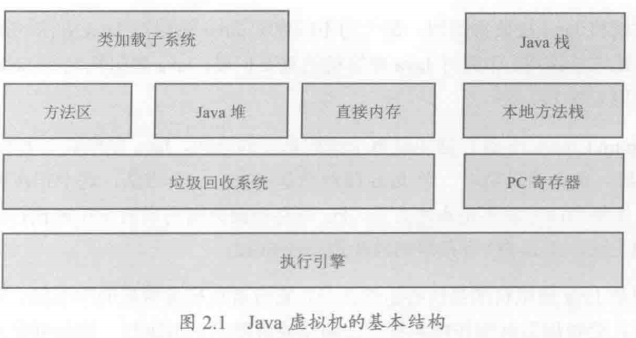
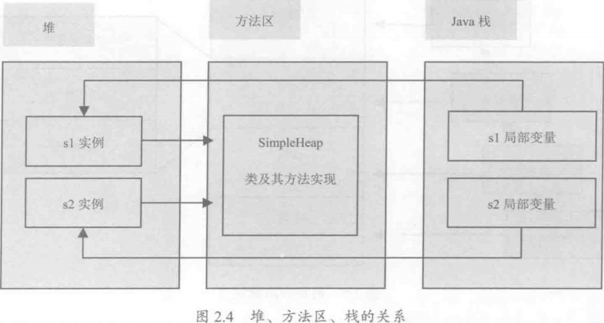

<!-- @import "[TOC]" {cmd:"toc", depthFrom:1, depthTo:6, orderedList:false} -->
<!-- code_chunk_output -->

* [架构](#架构)
	* [pc寄存器](#pc寄存器)
* [JVM的参数](#jvm的参数)
* [堆](#堆)
* [栈](#栈)
	* [局部变量表](#局部变量表)
		* [jclasslib](#jclasslib)
	* [操作数栈](#操作数栈)
	* [帧数据区](#帧数据区)
	* [栈上分配](#栈上分配)
* [方法区](#方法区)
	* [cglib](#cglib)

<!-- /code_chunk_output -->


# 架构



1. 类加载子系统将Class信息保存在方法区，方法区还存放运行时常量池信息。
2. 堆保存几乎所有的对象实例。堆是线程共享的。
3. Java NIO库可以访问Java堆外的直接内存。
4. 垃圾回收器对方法区、堆和直接内存进行回收。
5. 每个线程都有一个私有的栈。保存局部变量、方法参数。
6. JVM允许Java直接调用本地方法（通常是C）
7. 执行引擎执行虚拟机的字节码。

## pc寄存器

* [2.5.1　pc寄存器 - 51CTO.COM ](http://book.51cto.com/art/201312/421913.htm)

Java虚拟机可以支持多条线程同时执行，每一条Java虚拟机线程都有自己的pc（program counter）寄存器。在任意时刻，一条Java虚拟机线程只会执行一个方法的代码，这个正在被线程执行的方法称为该线程的当前方法（current method）。如果这个方法不是native的，那pc寄存器就保存Java虚拟机正在执行的字节码指令的地址，如果该方法是native的，那pc寄存器的值是undefined

# JVM的参数

```java
package geym.zbase.ch2;

public class SimpleArgs {
	public static void main(String[] args) {
		for(int i=0;i<args.length;i++){
			System.out.println("参数"+(i+1)+":"+args[i]);
		}
		System.out.println("-Xmx"+Runtime.getRuntime().maxMemory()/1000/1000+"M");
	}
}

```

* [java编译UTF-8文件乱码的问题 - 不落魄的书生的记事簿 - CSDN博客 ](http://blog.csdn.net/yaosongyuan/article/details/9120013)

```bash
#java编译UTF-8
javac -encoding UTF-8 geym\zbase\ch2\SimpleArgs.java
java geym.zbase.ch2.SimpleArgs
#设置最大堆
java -Xmx32m geym.zbase.ch2.SimpleArgs a
```

# 堆

几乎所有的对象都存放在堆中。通过垃圾回收机制，垃圾对象会被自动清理。

```json
[
    "老年代",
    "新生代"
    [
        "eden",
        "s0",
        "s1",
    ]
]
```

1. 大部分情况，对象首先分配在eden区
2. 第一次新生代回收，对象存活，进入s0或s1

```java
package geym.zbase.ch2.heap;

public class SimpleHeap {
    private int id;
    public SimpleHeap(int id){
        this.id=id;
    }
    public void show(){
        System.out.println("My ID is "+id);
    }
    public static void main(String[] args) {
        SimpleHeap s1=new SimpleHeap(1);
        SimpleHeap s2=new SimpleHeap(2);
        s1.show();
        s2.show();
    }
}
```



* 实例分配在堆中
* 描述类的信息放在方法区
* 局部变量存放在栈

# 栈

1. 栈是线程私有的内存空间。堆与程序数据相关，栈与线程相关。
2. 栈是先进后出的数据结构，出栈和入栈两种操作。函数调用压入栈帧；函数返回弹出栈帧。
3. 栈帧包含了局部变量表、操作数栈和帧数据。
4. 请求超过最大可用栈深度时，抛出StackOverflowError栈溢出错误。
5. 栈的大小决定了函数嵌套调用的层次。

```bash
#java编译UTF-8
javac -encoding UTF-8 geym\zbase\ch2\xss\TestStackDeep.java
java -Xss128K geym.zbase.ch2.xss.TestStackDeep
java -Xss256K geym.zbase.ch2.xss.TestStackDeep
```

```java
package geym.zbase.ch2.xss;

/**
 * -Xss1m
 * @author Administrator
 *
 */
public class TestStackDeep {
	private static int count=0;
	public static void recursion(long a,long b,long c){
		long e=1,f=2,g=3,h=4,i=5,k=6,q=7,x=8,y=9,z=10;
		count++;
		recursion(a,b,c);
	}
	public static void recursion(){
		count++;
		recursion();
	}
	public static void main(String args[]){
		try{
//			recursion(0L,0L,0L);
			recursion();
		}catch(Throwable e){
			System.out.println("deep of calling = "+count);
			e.printStackTrace();
		}
	}
}
```

## 局部变量表

1. 局部变量表用于保存函数的参数以及局部变量。变量只在当前函数调用有效。
2. 局部变量少的函数可以支持更深的函数调用。

```java
package geym.zbase.ch2.xss;

/**
 * -Xss1m
 * @author Administrator
 *
 */
public class TestStackDeep {
	private static int count=0;
	public static void recursion(long a,long b,long c){
		long e=1,f=2,g=3,h=4,i=5,k=6,q=7,x=8,y=9,z=10;
		count++;
		recursion(a,b,c);
	}
	public static void recursion(){
		count++;
		recursion();
	}
	public static void main(String args[]){
		try{
			recursion(0L,0L,0L);
			//recursion();
		}catch(Throwable e){
			System.out.println("deep of calling = "+count);
			e.printStackTrace();
		}
	}
}
```
### jclasslib

* [ingokegel/jclasslib: jclasslib bytecode viewer is a tool that visualizes all aspects of compiled Java class files and the contained bytecode. ](https://github.com/ingokegel/jclasslib)
* [直接修改别人jar包里面的class文件 工具:jclasslib - hexin373的专栏 - CSDN博客 ](http://blog.csdn.net/hexin373/article/details/6669813)

```bash
#java编译UTF-8
javac -encoding UTF-8 geym\zbase\ch2\localvar\LocalVarGC.java
java -XX:+PrintGC geym.zbase.ch2.localvar.LocalVarGC
```

栈帧中的局部变量表中的槽位(index)可以重用。一个局部变量过了其作用域，新申明的局部变量会复用过期局部变量的槽位(index)。

被局部变量表中直接或间接引用的对象不会被回收。

```java
package geym.zbase.ch2.localvar;

public class LocalVarGC {
	public void localvarGc1(){
		byte[] a=new byte[6*1024*1024];
		System.gc();
	}
	public void localvarGc2(){
		byte[] a=new byte[6*1024*1024];
		a=null;
		System.gc();
	}
	public void localvarGc3(){
		{
		byte[] a=new byte[6*1024*1024];
		}
		System.gc();
	}
	public void localvarGc4(){
		{
		byte[] a=new byte[6*1024*1024];
		}
		int c=10;
		System.gc();
	}
	public void localvarGc5(){
		localvarGc1();
		System.gc();
	}
	public static void main(String[] args) {
		LocalVarGC ins=new LocalVarGC();
		ins.localvarGc5();
	}
}
//localvarGc1，a引用数组，不回收
//localvarGc2，a置空，回收
//localvarGc3，a离开作用域，但依然存在，不回收
//localvarGc4，a离开作用域，c复用a的位置，回收
//localvarGc5，方法返回，栈帧销毁，回收
```

```bash
#java编译UTF-8
javac -encoding UTF-8 geym\zbase\ch2\localvar\LocalVarGC.java
java -XX:+PrintGC geym.zbase.ch2.localvar.LocalVarGC
```

## 操作数栈

操作数栈保存计算过程中的中间结果。

## 帧数据区

1. 帧数据区支持常量池解析、正常方法返回和异常处理等。
2. 帧数据区保存着常量池的指针。
3. 发生异常时在异常处理表中找到处理异常的代码。

## 栈上分配

1. 将线程私有对象分配在栈上，而不是在堆上。在函数调用后自行销毁，不需要垃圾回收器。
2. 栈上分配的基础是逃逸分析。逃逸分析即判断对象是否被其他函数引用。


```bash
#栈上分配不管用？
javac -encoding UTF-8 geym\zbase\ch2\onstackalloc\OnStackTest.java
java -Xmx10m -Xms10m -XX:+PrintGC geym.zbase.ch2.onstackalloc.OnStackTest
java -server -Xmx10m -Xms10m -XX:+DoEscapeAnalysis -XX:+PrintGC -XX:-UseTLAB -XX:+EliminateAllocations geym.zbase.ch2.onstackalloc.OnStackTest
java -server -Xmx10m -Xms10m -XX:+DoEscapeAnalysis -XX:+PrintGC geym.zbase.ch2.onstackalloc.OnStackTest
```

```java
package geym.zbase.ch2.onstackalloc;

/**
 * 栈上分配
 * -server -Xmx10m -Xms10m -XX:+DoEscapeAnalysis -XX:+PrintGC -XX:-UseTLAB  -XX:+EliminateAllocations
 * 
 * @author Geym
 *
 */
public class OnStackTest {
    public static class User{
        public int id=0;
        public String name="";
    }

    public static void alloc(){
        User u=new User();
        u.id=5;
        u.name="geym";
    }
    public static void main(String[] args) throws InterruptedException {
        long b=System.currentTimeMillis();
        for(int i=0;i<100000000;i++){
            alloc();
        }
        long e=System.currentTimeMillis();
        System.out.println(e-b);
    }
}
```

# 方法区

所有线程共享方法区。保存系统类的信息。系统保存多少个类由方法区决定。

1.6和1.7，方法区可以理解为永久区（Perm）。

-XX:PermSize
默认-XX:MaxPermSize为64MB

```bash
#初始5MB，最大5MB

mvn exec:java -Dexec.mainClass="com.gmail.mosoft521.ch02.perm.PermTest" -Dexec.args="-XX:+PrintGCDetails -XX:PermSize=5M -XX:MaxPermSize=5m"
```

* 1.8 使用元数据区代替永久区。
* 堆外的直接内存。
* 默认情况，虚拟机会耗尽所有可用系统内存。


maven

* [java - Including dependencies in a jar with Maven - Stack Overflow ](https://stackoverflow.com/questions/1729054/including-dependencies-in-a-jar-with-maven)


## cglib

* [CGLIB介绍与原理 - zghwaicsdn的专栏 - CSDN博客 ](http://blog.csdn.net/zghwaicsdn/article/details/50957474)
* [AOP的底层实现-CGLIB动态代理和JDK动态代理 - 田有朋的专栏 - CSDN博客 ](http://blog.csdn.net/dreamrealised/article/details/12885739)

```bash
# mvn exec:java方式执行并不成功
mvn clean package
java -classpath "target/classes;lib/*" -XX:+PrintGCDetails -XX:MaxMetaspaceSize=5M com.gmail.mosoft521.ch02.perm.PermTest
```

```java
package com.gmail.mosoft521.ch02.perm;

import java.util.HashMap;

/**
 * JDK1.6 1.7 -XX:+PrintGCDetails -XX:PermSize=5M -XX:MaxPermSize=5m
 * <p>
 * JDK1.8 -XX:+PrintGCDetails -XX:MaxMetaspaceSize=5M
 *
 * @author Geym
 */
public class PermTest {
    public static void main(String[] args) {
        int i = 0;
        try {
            for (i = 0; i < 100000; i++) {
                CglibBean bean = new CglibBean("geym.zbase.ch2.perm" + i, new HashMap());
            }
        } catch (Exception e) {
            System.out.println("total create count:" + i);
            throw e;
        }
    }
}
/*
[GC (Metadata GC Threshold) [PSYoungGen: 4926K->1211K(18944K)] 4926K->1219K(62976K), 0.0286192 secs] [Times: user=0.05 sys=0.00, real=0.03 secs]
[Full GC (Metadata GC Threshold) [PSYoungGen: 1211K->0K(18944K)] [ParOldGen: 8K->1099K(32256K)] 1219K->1099K(51200K), [Metaspace: 4055K->4055K(1056768K)], 0.0141232 secs] [Times: user=0.03 sys=0.00, real=0.01 secs]
[GC (Last ditch collection) [PSYoungGen: 0K->0K(18944K)] 1099K->1099K(51200K), 0.0005138 secs] [Times: user=0.00 sys=0.00, real=0.00 secs]
[Full GC (Last ditch collection) [PSYoungGen: 0K->0K(18944K)] [ParOldGen: 1099K->1041K(62976K)] 1099K->1041K(81920K), [Metaspace: 4055K->4055K(1056768K)], 0.0091786 secs] [Times: user=0.00 sys=0.00, real=0.01 secs]
[GC (Metadata GC Threshold) [PSYoungGen: 327K->32K(18944K)] 1369K->1073K(81920K), 0.0040550 secs] [Times: user=0.00 sys=0.00, real=0.00 secs]
[Full GC (Metadata GC Threshold) [PSYoungGen: 32K->0K(18944K)] [ParOldGen: 1041K->700K(94720K)] 1073K->700K(113664K), [Metaspace: 4067K->4067K(1056768K)], 0.0126064 secs] [Times: user=0.05 sys=0.00, real=0.01 secs]
[GC (Last ditch collection) [PSYoungGen: 0K->0K(21504K)] 700K->700K(116224K), 0.0008559 secs] [Times: user=0.00 sys=0.00, real=0.00 secs]
[Full GC (Last ditch collection) [PSYoungGen: 0K->0K(21504K)] [ParOldGen: 700K->697K(145408K)] 700K->697K(166912K), [Metaspace: 4067K->4067K(1056768K)], 0.0113519 secs] [Times: user=0.00 sys=0.00, real=0.01 secs]
[GC (Metadata GC Threshold) [PSYoungGen: 378K->96K(21504K)] 1076K->793K(166912K), 0.0004224 secs] [Times: user=0.00 sys=0.00, real=0.00 secs]
[Full GC (Metadata GC Threshold) [PSYoungGen: 96K->0K(21504K)] [ParOldGen: 697K->696K(197632K)] 793K->696K(219136K), [Metaspace: 4067K->4067K(1056768K)], 0.0046027 secs] [Times: user=0.00 sys=0.00, real=0.01 secs]
[GC (Last ditch collection) [PSYoungGen: 0K->0K(22528K)] 696K->696K(220160K), 0.0002820 secs] [Times: user=0.00 sys=0.00, real=0.00 secs]
[Full GC (Last ditch collection) [PSYoungGen: 0K->0K(22528K)] [ParOldGen: 696K->696K(269824K)] 696K->696K(292352K), [Metaspace: 4067K->4067K(1056768K)], 0.0044193 secs] [Times: user=0.00 sys=0.00, real=0.00 secs]
Exception in thread "main" java.lang.OutOfMemoryError: Metaspace
	at net.sf.cglib.core.AbstractClassGenerator.create(AbstractClassGenerator.java:237)
	at net.sf.cglib.beans.BeanMap$Generator.create(BeanMap.java:122)
	at net.sf.cglib.beans.BeanMap.create(BeanMap.java:58)
	at com.gmail.mosoft521.ch02.perm.CglibBean.<init>(CglibBean.java:35)
	at com.gmail.mosoft521.ch02.perm.PermTest.main(PermTest.java:17)
	at sun.reflect.NativeMethodAccessorImpl.invoke0(Native Method)
	at sun.reflect.NativeMethodAccessorImpl.invoke(NativeMethodAccessorImpl.java:62)
	at sun.reflect.DelegatingMethodAccessorImpl.invoke(DelegatingMethodAccessorImpl.java:43)
	at java.lang.reflect.Method.invoke(Method.java:498)
	at com.intellij.rt.execution.application.AppMain.main(AppMain.java:144)
Heap
 PSYoungGen      total 22528K, used 1259K [0x00000000eab00000, 0x00000000ec280000, 0x0000000100000000)
  eden space 20992K, 6% used [0x00000000eab00000,0x00000000eac3afc0,0x00000000ebf80000)
  from space 1536K, 0% used [0x00000000ec100000,0x00000000ec100000,0x00000000ec280000)
  to   space 1536K, 0% used [0x00000000ebf80000,0x00000000ebf80000,0x00000000ec100000)
 ParOldGen       total 269824K, used 696K [0x00000000c0000000, 0x00000000d0780000, 0x00000000eab00000)
  object space 269824K, 0% used [0x00000000c0000000,0x00000000c00ae3e8,0x00000000d0780000)
 Metaspace       used 4100K, capacity 5030K, committed 5120K, reserved 1056768K
  class space    used 459K, capacity 465K, committed 512K, reserved 1048576K
 */
```