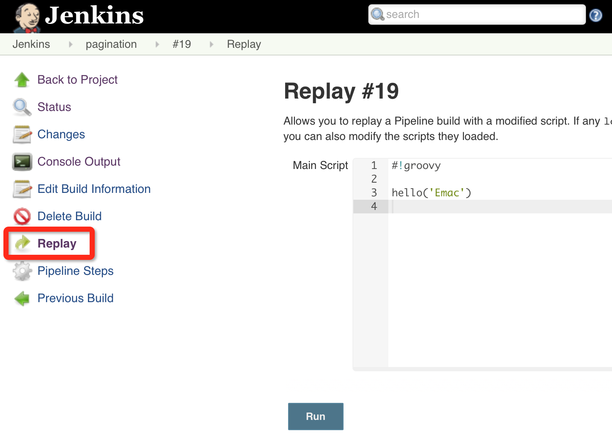

* [【Jenkins】Pipeline使用进阶 ](http://emacoo.cn/devops/jenkins-pipeline-tips/)

【Jenkins】Pipeline使用进阶
  2016-05-22     devops     原创·CI/CD
无所不能，无所不及的Pipeline
得益于Jenkins内嵌的Groovy支持，加上丰富的Step库，通过编写自定义Pipeline脚本你几乎可以实现任何复杂的构建、发布流程。下面简单谈谈使用Pipeline的四个段位。

# I. 启蒙老师：Snipper Generator
Jenkins晦涩的行文风格并没有随着2.0的发布有所改善，Step库的官方参考手册成功的延续了Jenkins一贯的惜字如金风格，大多数Step都只有一句话的描述和一些参数类型，罕有使用样例，比如Git Step。要理解这些Step，基本靠脑补。好在Jenkins提供了一款良心产品，Snipper Generator，帮助使用者在Pipeline配置界面3步生成正确的调用语句。


# II. 调试利器：Replay Pipeline
维护过CI的同学一定知道，在成功创建一个正确、稳定运行的CI任务之前，往往需要历经多次调试和优化，创建Pipeline更是如此。为了避免重复打开配置界面调整Pipeline脚本，Jenkins贴心的提供了Replay功能。打开任意一次执行历史，在左侧点击Replay按钮，即可复原该次执行所运行的Pipeline脚本，无论脚本来源是任务本身还是远程仓库。




# III. 隐藏秘籍：Workflow Global Library
很多人不知道，Jenkins默认会启动一个SSHD服务，用于在CLI方式下执行一些Jenkins命令。Jenkins 2.0在此基础上，绑定了一个本地Git库（Workflow Global Library，简称WGL），用于上传一些全局共享的Groovy脚本，供同一Jenkins实例下所有Pipeline脚本调用。具体使用步骤如下：

* 进入系统配置界面，找到SSH Server配置项，指定一个固定的SSH端口。
* 进入当前用户的配置页面，绑定SSH Public Key。
* 打开命令行，运行git clone ssh://<user>@<host>:<port>/workflowLibs.git拉取WGL。
* 在Git库的根目录下创建vars目录，编写Groovy脚本并存放于此，提交代码并Push至远程库。
```groovy
// hello.groovy，一个简单的示例Groovy脚本，定义了一个名为hello的全局方法
def call(name) {
    echo "Hello, ${name}!"
}
```

# IV. 如来神掌：Jenkins Plugin
如果你需要同时维护多个Jenkins实例，那么WGL就不再适用了，因为每一个Jenkins实例你都需要上传一份脚本。这时就要祭出Jenkins Plugin大法，也即将共享的Groovy脚本封装到一个自定义Jenkins Plugin中，然后安装到需要的Jenkins实例中，以后也可以进行统一升级，有效降低了维护成本。要实现这一点，除了[传统的定义Jenkins Plugin的方法](https://wiki.jenkins-ci.org/display/JENKINS/Extend+Jenkins)，Jenkins[官方博客](https://jenkins.io/blog/2016/04/21/dsl-plugins/)还提供了另一种更为简便的封装方式，具体可以参考我的这个GitHub项目，[demo-pipeline-step](https://github.com/emac/demo-pipeline-step)。

# 延伸阅读
利用强大、灵活的Pipeline，我们可以像组装乐高玩具一般操纵Jenkins，根据实际情况构建所需的CI/CD流程。近期我设计的 [Frigate](https://zybuluo.com/emac/note/330205) 发布系统正式利用Jenkins Pipeline无缝衔接各个发布环节。

参考
* [Replay a Pipeline with script edits](https://jenkins.io/blog/2016/04/14/replay-with-pipeline/)
* [Making your own DSL with plugins, written in Pipeline script](https://jenkins.io/blog/2016/04/21/dsl-plugins/)