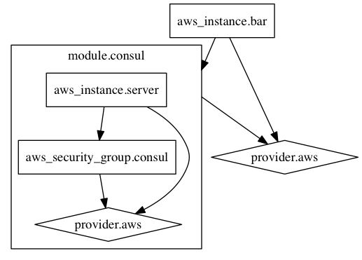

# 概述

## 官网

[Terraform by HashiCorp ](https://www.terraform.io/)
[hashicorp/terraform: Terraform is a tool for building, changing, and combining infrastructure safely and efficiently. ](https://github.com/hashicorp/terraform)

## 简介

[Terraform首页、文档和下载 - 基础架构管理工具 - 开源中国社区 ](https://www.oschina.net/p/terraform-tool)

Terraform 是一个安全和高效的用来构建、更改和合并基础架构的工具。采用 Go 语言开发。Terraform 可管理已有的流行的服务，并提供自定义解决方案。

Terraform 的关键特性：
* 架构就是代码
* 执行计划
* 资源图
* 变更自动化

## 使用Terraform与Consul自动化现代数据中心

[使用Terraform与Consul自动化现代数据中心 ](http://www.infoq.com/cn/news/2015/05/hashimoto-modern-datacenter)

[vagrant](https://www.vagrantup.com/)
[packer](https://www.packer.io/)

单机 -> 多物理机 -> 多虚拟机 -> 容器

[CFEngine](http://cfengine.com/)、[Chef](https://www.chef.io/chef/)、[Puppet](https://puppetlabs.com/)和[Ansible](http://www.ansible.com/)

数据中心的核心工作通常包括获取（acquisition）、提供（provision）、更新（update）和销毁（destruction）资源（比如服务器、数据存储和负载平衡器等）。

自动化的现代数据中心的需求体现为：
* 一条命令部署
* 弹性分布式系统
* 自动伸缩、自动健康监测
* 经过知识梳理获得更好的团队合作

### Terraform

Terraform，这一款可以有效地构建、结合并启动跨数据中心和不同供应商的基础设施的工具。

Terraform可由“terraform apply”一条命令来激活，可以使用“terraform plan”命令来预览活跃的实例。该命令的运行输出是一个有序列表，描述了声明式定义的当前基础设施的状态变更。同时，还能表明变更是就地执行的，还是销毁的性质的（例如，重新启动服务器）。这个信息可用于确定操作是否适用于特定的时间点，例如，维护窗口是否打开。

plan命令的输出也可以保存到文件中，以便日后决定执行基础设施的变更。Hashimoto认为，预览基础设施变更的能力是Terraform的最重要的特征之一。可以在目前开发的工作流程中，组合基础设施代码的变更和配置计划，如创建pull请求、审查diff和接受变更。

### Consul
Consul，这是一款以跨数据中心、高可用的方式提供服务发现、配置和编排的工具。

Consul通过DNS或HTTP API提供服务发现功能，同时支持跨数据中心的内部服务或外部服务的发现。 使用shell脚本实现了健康检查，并允许创建自定义的服务验证协议。 Consul还提供了高可用的键值对存储，由此可以暴露一致的存储值，用于配置参数的调优，而不必非要执行配置管理工具。 可调优的操动实例包括指定服务的位置、指明系统处于维护模式，或者设置服务的QoS参数。

Consul还提供了一套编排原语、通过UDP协议跨数据中心广播异步“事件”、通过TCP协议让指定的计算机同步执行“exec”指令，以及通过实现长轮询、react、事件机制或者其他操作实现定制化的监控。

# kubernetes

[Provider: Kubernetes - Terraform by HashiCorp ](https://www.terraform.io/docs/providers/kubernetes/index.html)
[Deploy Kubernetes w/ Ansible & Terraform – Spencer's Blog ](https://rsmitty.github.io/Terraform-Ansible-Kubernetes/)

