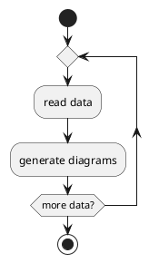
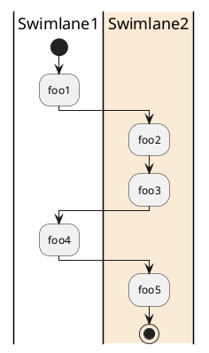

http://plantuml.com/activity-diagram-beta#sdl

## 重复循环

你可以使用关键字repeat和repeatwhile进行重复循环。

```puml
@startuml

start

repeat
  :read data;
  :generate diagrams;
repeat while (more data?)

stop
```

@enduml

## 泳道Swimlanes

```puml
@startuml
|Swimlane1|
start
:foo1;
|#AntiqueWhite|Swimlane2|
:foo2;
:foo3;
|Swimlane1|
:foo4;
|Swimlane2|
:foo5;
stop
@enduml
```