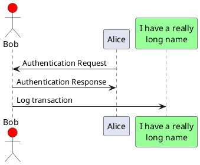

http://plantuml.com/sequence-diagram

# 关键字 as 用于重命名参与者

你可以使用RGB值或者颜色名修改 actor 或参与者的背景颜色。

```puml
@startuml
actor Bob #red
' The only difference between actor
'and participant is the drawing
participant Alice
participant "I have a really\nlong name" as L #99FF99
/' You can also declare:
   participant L as "I have a really\nlong name"  #99FF99
  '/

Alice->Bob: Authentication Request
Bob->Alice: Authentication Response
Bob->L: Log transaction
@enduml
```