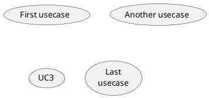
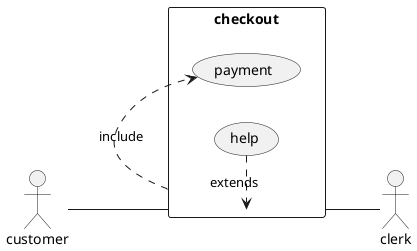

* http://plantuml.com/use-case-diagram

```puml
@startuml

(First usecase)
(Another usecase) as (UC2)  
usecase UC3
usecase (Last\nusecase) as UC4

@enduml
```

## 一个完整的例子

```puml
@startuml
left to right direction
skinparam packageStyle rectangle
actor customer
actor clerk
rectangle checkout {
  customer -- (checkout)
  (checkout) .> (payment) : include
  (help) .> (checkout) : extends
  (checkout) -- clerk
}
@enduml
```
