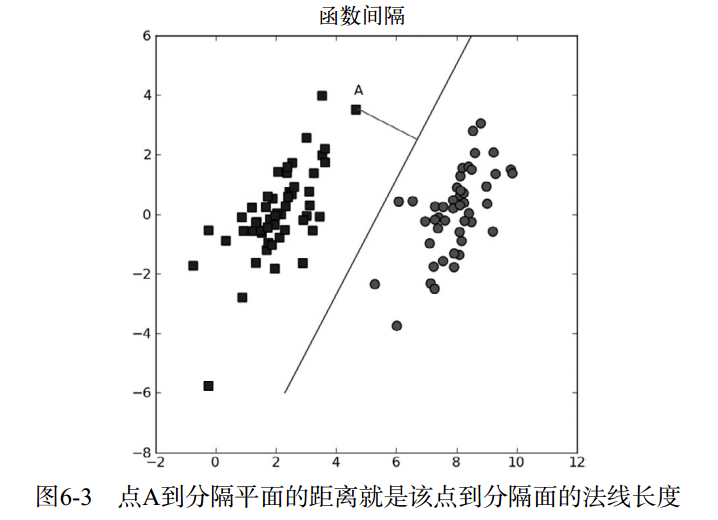

在Python中，如果某行以\符号结束，那么就意味着该行语句没有结束并会在下一行延续

# 程序清单6-2 简化版SMO算法 smoSimple

```py
# 创建一个alpha向量并将其初始化为0向量
# 当迭代次数小于最大迭代次数时（外循环）
#     对数据集中的每个数据向量（内循环）：
#     如果该数据向量可以被优化：
#         随机选择另外一个数据向量
#         同时优化这两个向量
#         如果两个向量都不能被优化，退出内循环
#     如果所有向量都没被优化，增加迭代数目，继续下一次循环
def smoSimple(dataMatIn, classLabels, C, toler, maxIter):
    dataMatrix = mat(dataMatIn); labelMat = mat(classLabels).transpose() # 转换之前是list的类型，转换之后是矩阵类型
    b = 0; m,n = shape(dataMatrix)
    alphas = mat(zeros((m,1)))
    iter = 0
    while (iter < maxIter):
        alphaPairsChanged = 0
        for i in range(m):
            fXi = float(multiply(alphas,labelMat).T*(dataMatrix*dataMatrix[i,:].T)) + b
            Ei = fXi - float(labelMat[i])#if checks if an example violates KKT conditions
            if ((labelMat[i]*Ei < -toler) and (alphas[i] < C)) or ((labelMat[i]*Ei > toler) and (alphas[i] > 0)):
                j = selectJrand(i,m)
                fXj = float(multiply(alphas,labelMat).T*(dataMatrix*dataMatrix[j,:].T)) + b
                Ej = fXj - float(labelMat[j])
                alphaIold = alphas[i].copy(); alphaJold = alphas[j].copy();
                if (labelMat[i] != labelMat[j]):
                    L = max(0, alphas[j] - alphas[i])
                    H = min(C, C + alphas[j] - alphas[i])
                else:
                    L = max(0, alphas[j] + alphas[i] - C)
                    H = min(C, alphas[j] + alphas[i])
                if L==H: print "L==H"; continue
                eta = 2.0 * dataMatrix[i,:]*dataMatrix[j,:].T - dataMatrix[i,:]*dataMatrix[i,:].T - dataMatrix[j,:]*dataMatrix[j,:].T
                if eta >= 0: print "eta>=0"; continue
                alphas[j] -= labelMat[j]*(Ei - Ej)/eta
                alphas[j] = clipAlpha(alphas[j],H,L)
                if (abs(alphas[j] - alphaJold) < 0.00001): print "j not moving enough"; continue
                alphas[i] += labelMat[j]*labelMat[i]*(alphaJold - alphas[j])#update i by the same amount as j
                                                                        #the update is in the oppostie direction
                b1 = b - Ei- labelMat[i]*(alphas[i]-alphaIold)*dataMatrix[i,:]*dataMatrix[i,:].T - labelMat[j]*(alphas[j]-alphaJold)*dataMatrix[i,:]*dataMatrix[j,:].T
                b2 = b - Ej- labelMat[i]*(alphas[i]-alphaIold)*dataMatrix[i,:]*dataMatrix[j,:].T - labelMat[j]*(alphas[j]-alphaJold)*dataMatrix[j,:]*dataMatrix[j,:].T
                if (0 < alphas[i]) and (C > alphas[i]): b = b1
                elif (0 < alphas[j]) and (C > alphas[j]): b = b2
                else: b = (b1 + b2)/2.0
                alphaPairsChanged += 1
                print "iter: %d i:%d, pairs changed %d" % (iter,i,alphaPairsChanged)
        if (alphaPairsChanged == 0): iter += 1
        else: iter = 0
        print "iteration number: %d" % iter
    return b,alphas
```

# 参考

1. 机器学习实战.Peter.2013
    1. https://github.com/pbharrin/machinelearninginaction.git
2. svm原理详细推导 https://blog.csdn.net/weixin_42001089/article/details/83276714
    1. SVM SMO算法代码详细剖析 https://blog.csdn.net/weixin_42001089/article/details/83420109
4. 支持向量机—SMO算法源码分析 https://blog.csdn.net/lilong117194/article/details/78238841
    1. 情感分析之电影评论分析-基于Tensorflow的LSTM https://blog.csdn.net/lilong117194/article/details/82217271#comments
6. 机器学习——支持向量机(SVM)之拉格朗日乘子法，KKT条件以及简化版SMO算法分析 - tonglin0325 - 博客园 https://www.cnblogs.com/tonglin0325/p/6078439.html