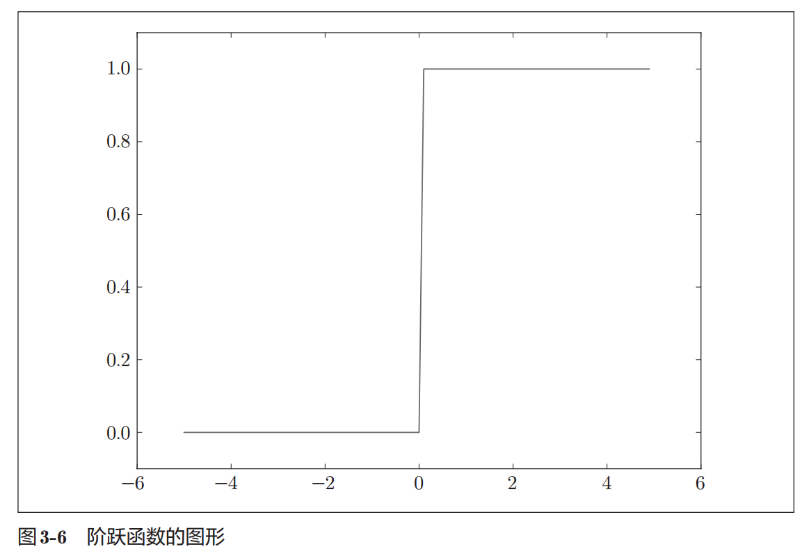
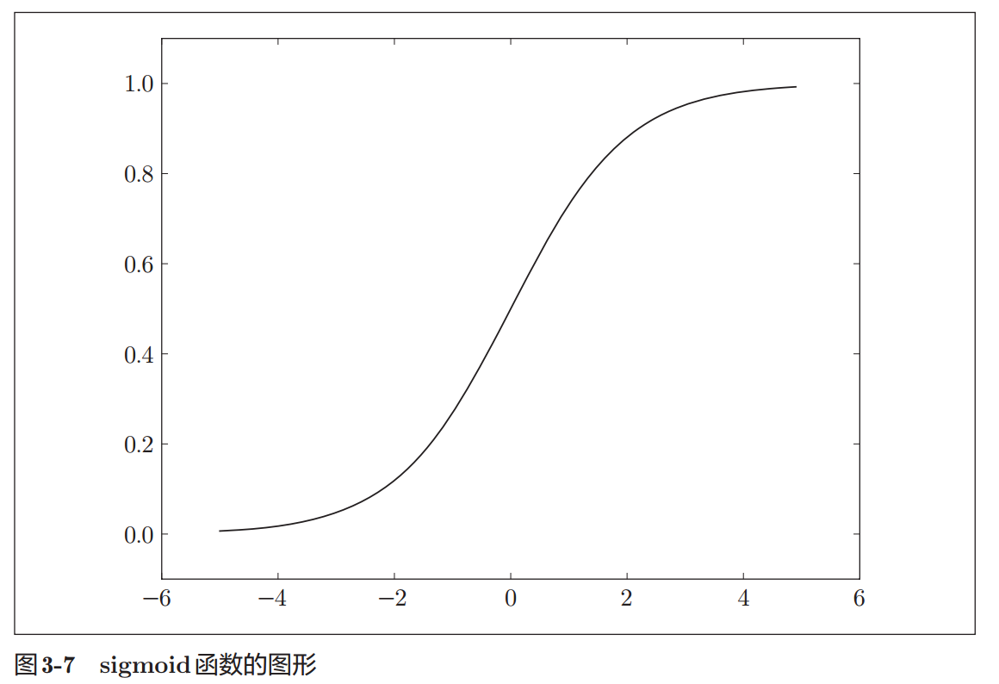

# 3 阶跃函数的图形

```py
import numpy as np
import matplotlib.pylab as plt

def step_function(x):
    return np.array(x>0, dtype=np.int)

x = np.arange(-5.0, 5.0, 0.1) # 在−5.0到5.0的范围内，以0.1为单位，生成NumPy数组（[-5.0, -4.9, ..., 4.9]）
y = step_function(x)
plt.plot(x, y)
plt.ylim(-0.1, 1.1) # 指定y轴的范围
plt.show()
```



阶跃函数以0为界，输出从0切换为1（或者从1切换为0）。它的值呈阶梯式变化，所以称为`阶跃函数`

# 4. sigmoid函数的实现

1. NumPy的广播功能使sigmoid函数支持NumPy数组

```py
def sigmoid(x):
    return 1 / (1+np.exp(-x))
# >>> x = np.array([-1.0, 1.0, 2.0])
# >>> sigmoid(x)
# array([ 0.26894142, 0.73105858, 0.88079708])

x = np.arange(-5.0, 5.0, 0.1)
y = sigmoid(x)
plt.plot(x, y)
plt.ylim(-0.1, 1.1) # 指定y轴的范围
plt.show()
```



# 5. sigmoid函数和阶跃函数的比较


1. 平滑性：
    1. sigmoid是一条平滑的曲线，输出随着输入发生连续性的变化
    2. 阶跃函数以0为界，输出发生急剧性的变化
2. 返回值：
    1. 感知机中神经元之间流动的是0或1的二元信号
    2. 神经网络中流动的是连续的实数值信号

# 6. 非线性函数

jiay

# 参考

1. 深度学习入门.基于Python的理论与实现.斋藤康毅.2018 -> 3.2激活函数