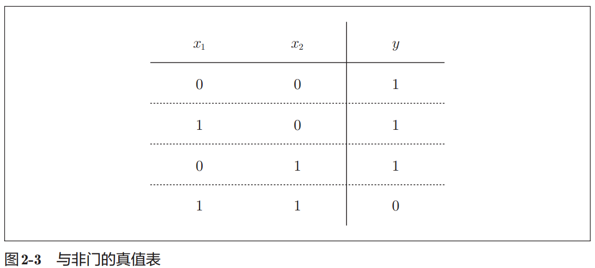

# 1. 与门 AND gate

1. 输入信号和输出信号的对应表称为`真值表`
2. 与门仅在两个输入均为1时输出1，其他时候则输出0
3. 满足图2-2的条件的参数的选择方法有无数多个，(w1, w2, θ) = (0.5, 0.5, 0.7)

# 2. 与非门 NAND gate

1. 与非门就是颠倒了与门的输出
2. 仅当 $x_1$ 和 $x_2$ 同时为1时输出0，其他时候则输出1
3. 只要把实现与门的参数值的符号取反，就可以实现与非门，(w1, w2, θ) = (−0.5, −0.5, −0.7)

# 3. 或门 OR gate

1. 只要有一个输入信号是1，输出就为1

1. 与门、与非门、或门的感知机构造是一样的。3个门电路只有参数的值（权重和阈值）不同

# 参考

1. 深度学习入门.基于Python的理论与实现.斋藤康毅.2018 -> 2.1感知机是什么