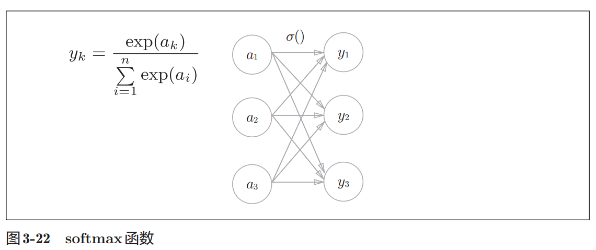

# 1. 恒等函数和softmax函数

1. 神经网络需要根据情况改变输出层的激活函数
    1. 回归问题用恒等函数
        1. 回归问题是根据某个输入预测一个（连续的）数值的问题
    2. 分类问题用softmax函数
        1. 分类问题是数据属于哪一个类别的问题

2. 
    1. softmax函数公式
        1. exp(x)是表示 $e^{x}$ 的指数函数（e是纳皮尔常数2.7182 . . .）。
        2. 假设输出层共有n个神经元，计算第k个神经元的输出 $y_{k}$。
        3. softmax函数的分子是输入信号$a_k$的指数函数，分母是所有输入信号的指数函数的和
    2. softmax函数图
        1. softmax函数的输出通过箭头与所有的输入信号相连
        2. 输出层的各个神经元都受到所有输入信号的影响

3. softmax函数python实现

```py
a = np.array([0.3, 2.9, 4.0])
exp_a = np.exp(a) # 指数函数
print(exp_a) # [ 1.34985881 18.17414537 54.59815003]
sum_exp_a = np.sum(exp_a) # 指数函数的和
print(sum_exp_a) # 74.1221542102

y = exp_a / sum_exp_a
print(y) # [ 0.01821127 0.24519181 0.73659691]
```

4. 定义softmax通用函数

```py
def softmax(a):
    exp_a = np.exp(a)
    sum_exp_a = np.sum(exp_a)
    y = exp_a / sum_exp_a
    
    return y
```

# 参考

1. [Markdown语法和LaTeX数学记号速查手册 ](http://www.domuse.com/markdown-and-latex-equation-handbook.html)
2. 深度学习入门.基于Python的理论与实现.斋藤康毅.2018 -> 3.5.1恒等函数和softmax函数