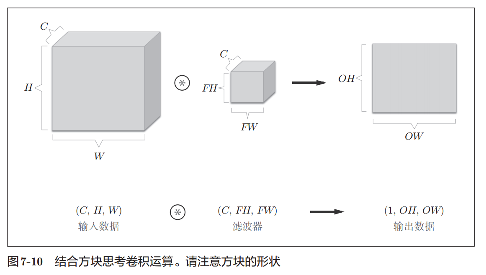
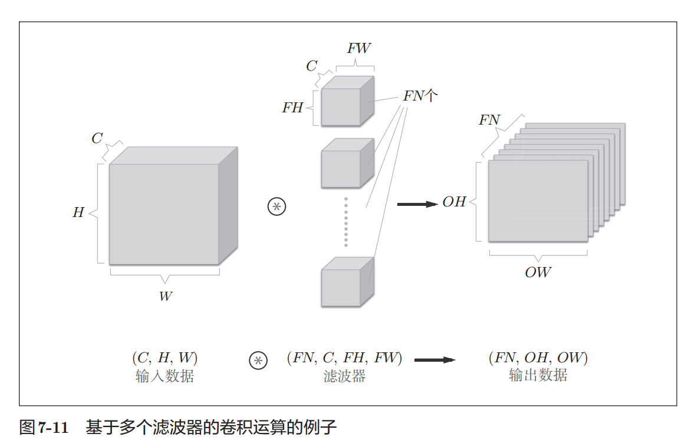

1. 
    1. 输入数据：通道数为 C、高度为H、长度为W的数据的形状可以写成（C, H, W）
    2. 滤波器：通道数为 C、滤波器高度为 FH（Filter Height）、长度为FW（Filter Width）时，可以写成（C, FH, FW）
    3. 数据输出：一张特征图
2. 
    1. 通过应用FN个滤波器，输出特征图也生成了FN个。
        1. 将这FN个特征图汇集在一起，就得到了形状为(FN, OH, OW)的方块
    2. 滤波器的权重数据要按(output_channel, input_channel, height, width)的顺序书写。
        1. 通道数为3、大小为5 × 5的滤波器有20个时，可以写成(20, 3, 5, 5)
3. 

# 参考

1. 深度学习入门.基于Python的理论与实现.斋藤康毅.2018 -> 7.2.6多个滤波器的卷积运算