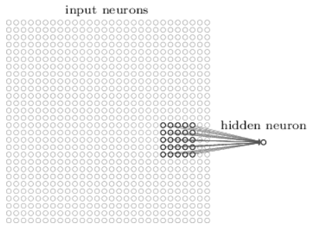

卷积神经网络及图像处理中共享权重、特征映射等理解 - qq_30979017的博客 - CSDN博客 https://blog.csdn.net/qq_30979017/article/details/79501511

1. 卷积神经网络有三个基本概念：
    1. 局部感知域（local receptive fields）
    2. 共享权重(shared weights)
    3. 池化（pooling）。
2. 局部感知域: 
    1. 以大小为28X28的图像为例，假如第一个隐藏层的神经元与输入层的一个5X5的区域连接，这个5X5的区域就叫做局部感知域。
    2. 局部感知域沿着从左往右，从上往下的顺序滑动，就会得对应隐藏层中不同的神经元。
    3. 如果输入层是尺寸为28X28的图像，局部感知域大小为5X5,那么得到的第一个隐藏层的大小是24X24。
3. 共享权重
    1. 上面得到的第一隐藏层中的24X24个神经元都使用同样的5X5个权重
    2. 第一个隐藏层中的所有神经元都检测在图像的不同位置处的同一个特征。（权重共享，检测特征相同）
    3. 因此也将从输入层到隐藏层的这种映射称为特征映射（或称作filters, kernels）。该特征映射的权重称为共享权重，其偏差称为共享偏差。
4. 池化层（pooling layers） 
    1. 池化层通常紧随卷积层之后使用，其作用是简化卷积层的输出。!{[图04.池化层.png](图04.池化层.png)
    2. 例如，池化层中的每一个神经元可能将前一层的一个2X2区域内的神经元求和。
    3. 而另一个经常使用的max-pooling，该池化单元简单地将一个2X2的输入域中的最大激励输出
    4. 如果卷积层的输出包含24X24个神经元，那么在池化后可得到12X12个神经元