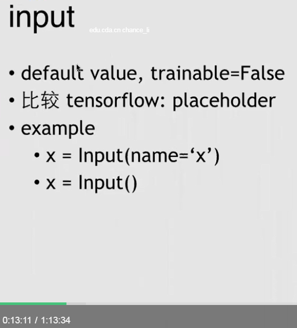

1. 
    1. default value, trainable=False
    2. 比较tensorflow: placeholder
    3. example
        1. x = input(name='X')
        2. x = input()
2. 
    1. default value, trainable=True
    2. example
        1. x = Variable([2,2], name='x')
        2. x = Variable([1,2,3,4], trainable=False, name='x')
        3. x = Variable(name='x')
2. 
    1. graph = Graph(feed_dict)
    2. sess = Session(graph)
    3. sess.run(ops=[node0,...], feed_dict={})
        1. first parameter is operation to be executed, second parameter is the input list
    4. sess.optimize(optimizer, learning_rate=0.1)
    5. sess.forward([node0,...])
        1. 返回数值values
    6. sess.backward([node0,...])
        1. 返回梯度gradients