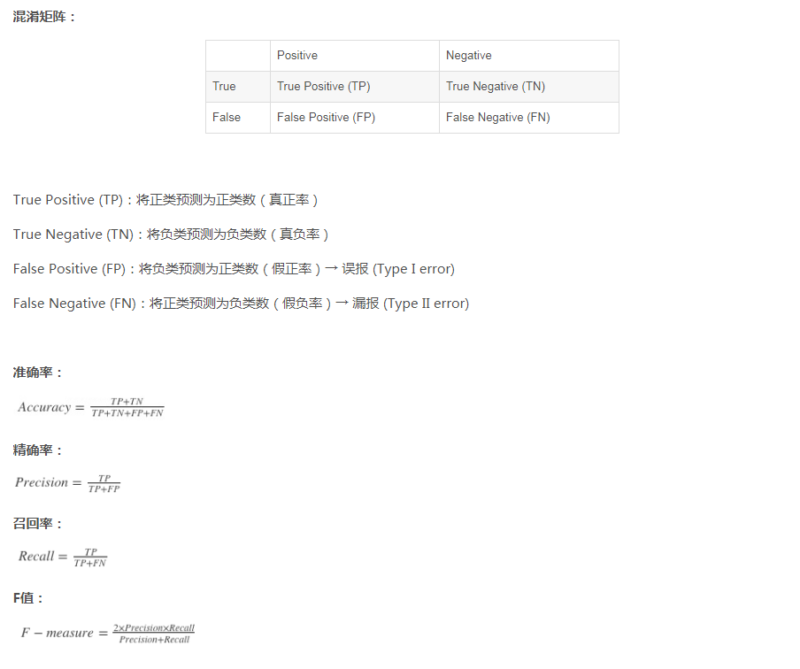

准确率（precision）与召回率(recall) - 简书 https://www.jianshu.com/p/54ed63a7f816

1. 精确率是针对我们预测结果而言的，它表示的是预测为正的样本中有多少是真正的正样本。
    1. 正类预测为正类(TP)，负类预测为正类(FP) 
    2. P = TP/(TP+FP)
2. 召回率是针对我们原来的样本而言的，它表示的是样本中的正例有多少被预测正确了。
    1. 正类预测成正类(TP)，正类预测为负类(FN)
    2. R = TP/(TP+FN)

