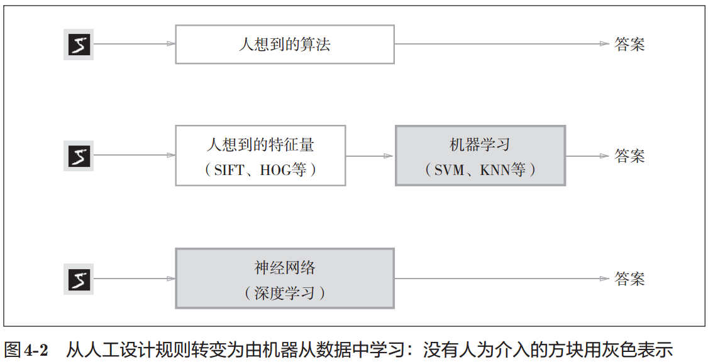

# 0. 神经网络的学习

1. 神经网络的学习
    1. `学习`是指从训练数据中自动获取最优权重参数的过程
    2. `学习的目的`就是以损失函数为基准，找出能使它的值达到最小的权重参数
    3. 可以使用`利用了函数的斜率的梯度法`
2. 从数据中学习
    1. `从数据中学习`是指可以由数据自动决定权重参数的值

# 1. 数据驱动

1. 机器学习
    1. 先从图像中提取出`特征量`，再用机器学习技术学习这些特征量的模式
    2. 即使使用特征量和机器学习的方法，也需要`针对不同的问题人工考虑合适的特征量`
2. 神经网络
    1. 图像中包含的重要特征都是由机器来学习的
    2. 神经网络的优点是对所有的问题都可以用同样的流程来解决

# 2. 训练数据和测试数据

1. 一般将数据分为训练数据和测试数据
    1. 首先，使用训练数据进行学习，寻找最优的参数
    2. 然后，使用测试数据评价训练得到的模型的实际能力
    3. 最求的是模型的`泛化能力`。`泛化能力`是指处理未被观察过的数据(不包含在训练数据中的数据)的能力
    4. 只对某个数据集过度拟合的状态称为`过拟合(over fitting)`

# 参考

1. 深度学习入门.基于Python的理论与实现.斋藤康毅.2018
    1. 2.3感知机的实现