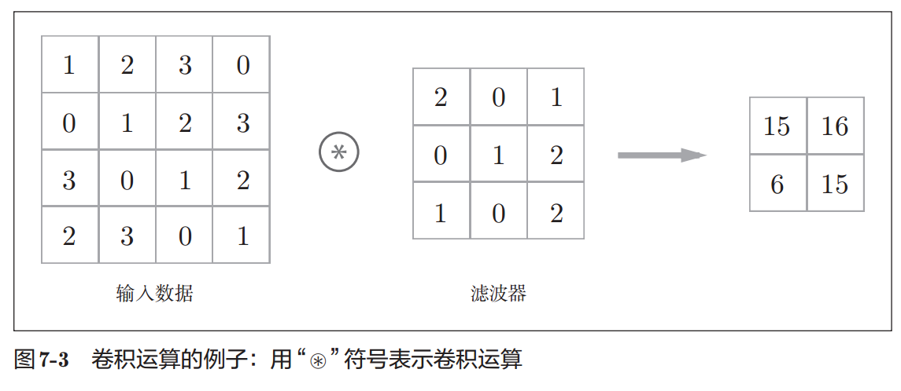
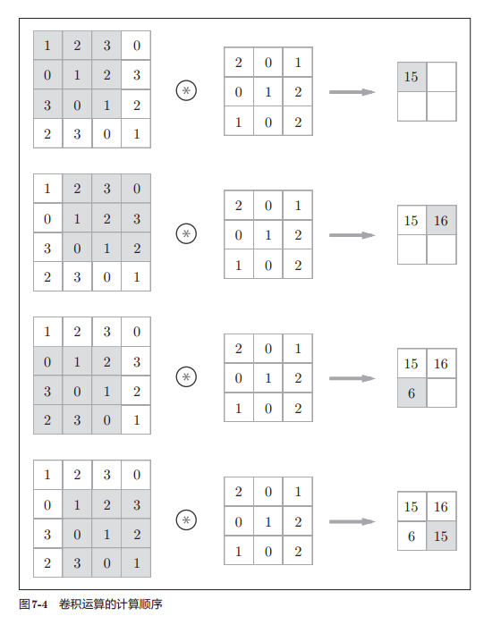
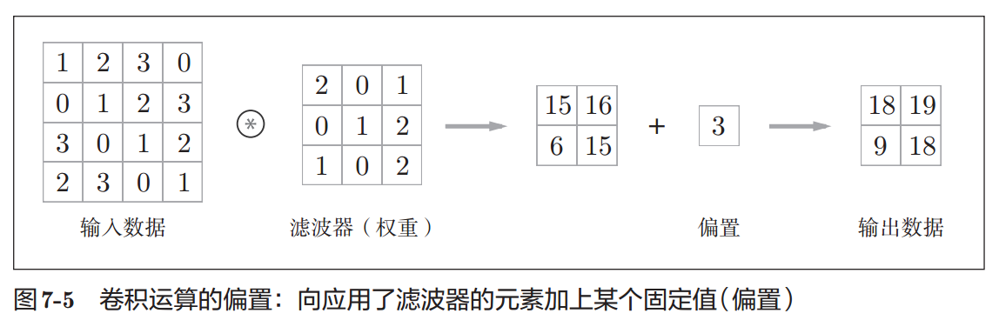
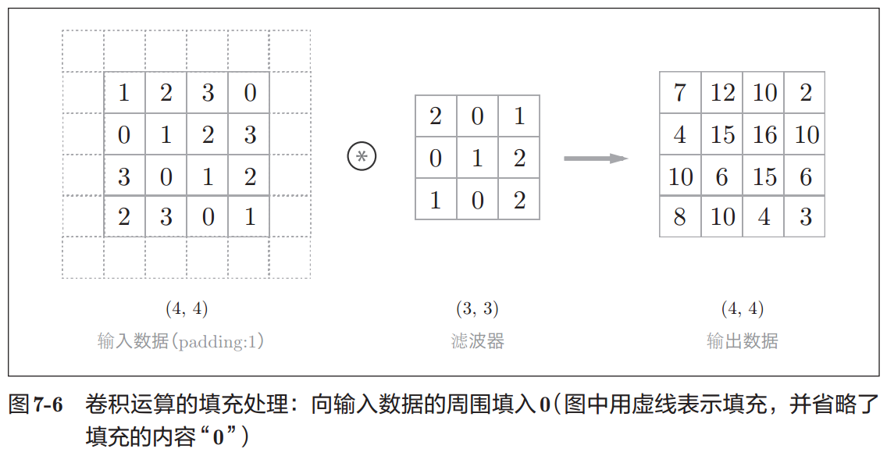
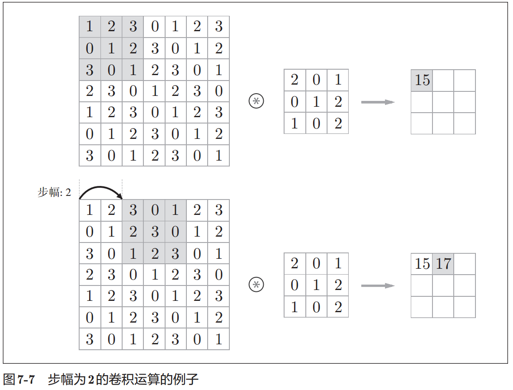
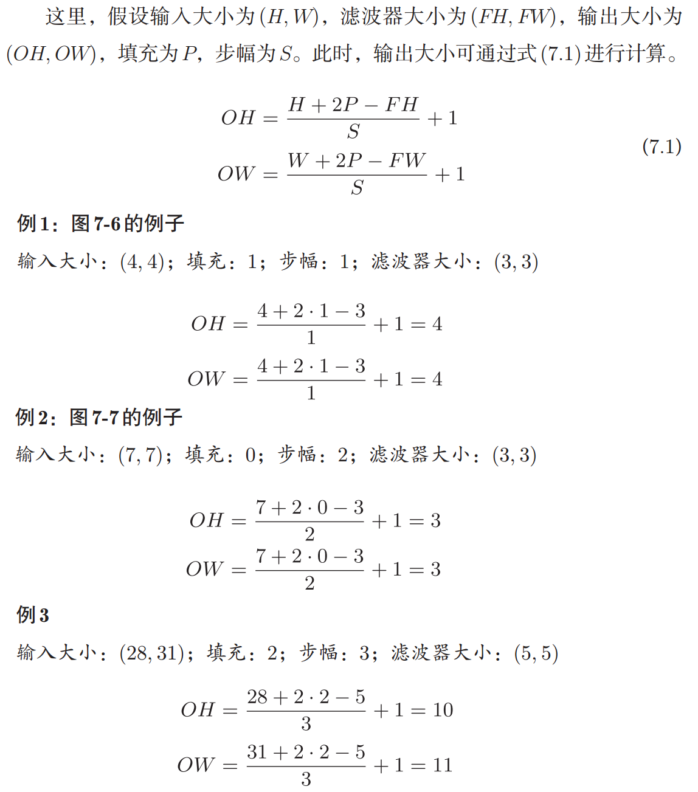
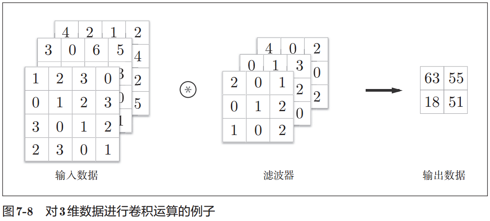
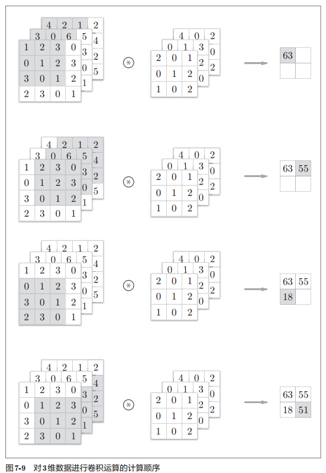
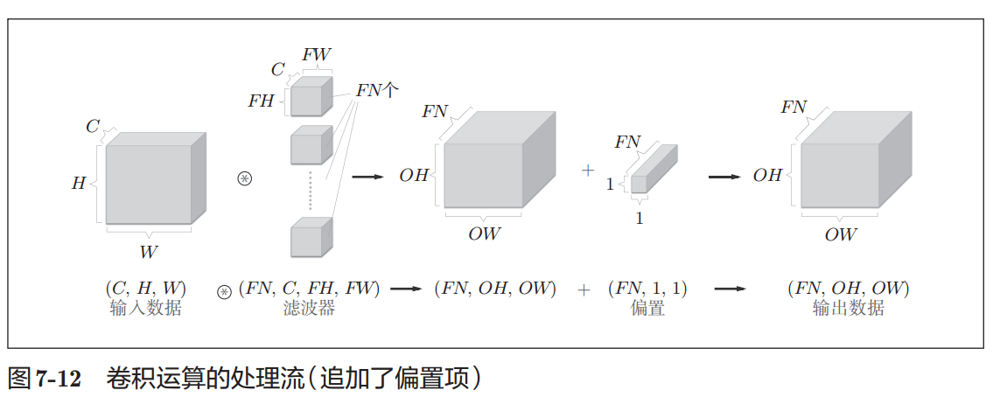
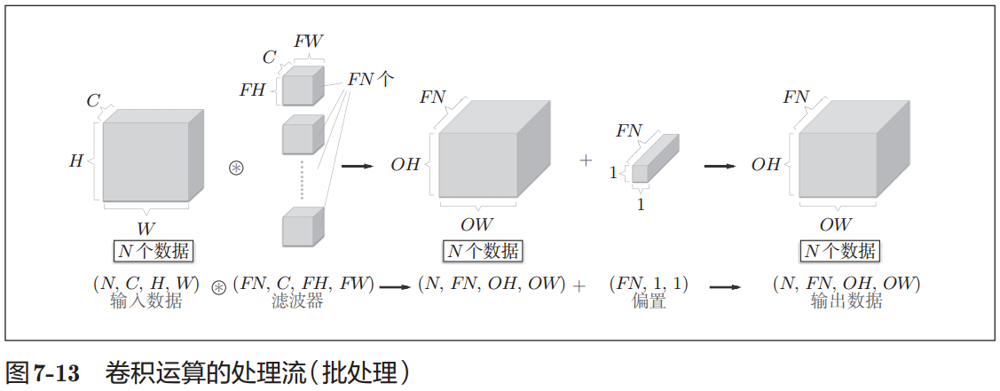

# 1. 全连接层存在的问题

1. 全连接层Affine层
    1. 在全连接层中，相邻层的神经元全部连接在一起，输出的数量可以任意决定
    2. 向全连接层输入时，需要将3维数据拉平为1维数据
2. 卷积层
    1. 卷积层可以保持形状不变
    2. 卷积层的输入输出数据称为`特征图(feature map)`
        1. 输入数据称为`输入特征图(input feature map)`
        2. 输出数据称为`输出特征图(output feature map)`

# 2. 卷积运算

1. 输入大小时(4,4)，`滤波器`大小是(3,3)，输出大小是(2,2)

2. 卷积运算
    1. 对于输入数据，卷积运算以一定间隔滑动滤波器的`窗口`并应用
    2. 将各个位置上`滤波器`的元素和`输入`的对应元素相乘，然后再求和(`乘积累加运算`)
    3. 将结果保存到输出的对应位置

3. 偏置通常只有1个，这个值会被应用了滤波器的所有元素上
4. 过滤器filter或内核kernel
    1. `过滤器`将当前层神经网络上的一个子节点矩阵转化为下一层神经网络上的一个单位节点矩阵
    2. `单位节点矩阵`指的是一个长和宽都为1，但深度不限的节点矩阵
5. 过滤器结构
    1. 过滤器的尺寸。过滤器所处理的节点矩阵的长和宽，常用的过滤器尺寸有 3*3 或 5*5 
    2. 过滤器处理的矩阵深度和当前层神经网络节点矩阵的深度是一致的，所以虽然节点举证是三维的，但过滤器的尺寸只需要指定两个维度
    3. 处理得到的单位节点矩阵的深度需要人工指定
    4. 过滤器的尺寸指的是一个过滤器输入节点矩阵的大小，而深度指的是输出单位节点矩阵的深度

# 3. 填充padding

1. 填充padding
    1. 为了`避免尺寸的变化`，可以在当前矩阵的边界上加入全0填充(zero-padding)
    2. 对大小为为(4,4)的输入数据应用了幅度为1的填充
    3. `幅度为1的填充`是指用幅度为1像素的0填充周围
    4. 通过填充，大小为(4,4)的输入数据变成了(6,6)的形状
    5. 应用大小为(3,3)的滤波器，生成了大小为(4,4)的输出数据
2. 使用填充后，卷积运算就可以在保持空间大小不变的情况下将数据传给下一层

# 4. 步幅stride

1. 步长
    1. 设置过滤器移动的步长来调整结果矩阵的大小
    2. 增大`步幅`后，输出大小会变小
    3. 增大`填充`后，输出大小会变大

使用 padding 和不使用 padding 的输出维度

使用 padding=全零填充，SAME，入长/步长，（如果不能整除，向上取整）
不使用 padding，VALID，(入长-核长+1)/步长，（向上取整）

padding公式
首先，定义变量：
输入图片的宽和高：i_w 和 i_h
输出特征图的宽和高：o_w 和 o_h
过滤器的宽和高：f_w 和 f_h
宽和高方向的步长：s_w 和 s_h
宽和高方向总的补零个数：pad_w 和 pad_h
顶部和底部的补零个数：pad_top 和 pad_bottom
左部和右部的补零个数：pad_left 和 pad_right

2. VALID模式，输出的宽和高为
o_w = （i_w - f_w + 1）/ s_w #（结果向上取整）
o_h = （i_h - f_h + 1）/ s_h  #（结果向上取整）
3. SAME模式，输出的宽和高为
o_w = i_w / s_w#（结果向上取整）
o_h = i_h / s_h#（结果向上取整）

    各个方向的补零个数为：max()为取较大值，

pad_h = max（( o_h -1 ) × s_h + f_h - i_h ， 0）
 pad_top = pad_h / 2  # 注意此处向下取整
 pad_bottom = pad_h - pad_top
 pad_w = max（( o_w -1 ) × s_w + f_w - i_w ， 0）
 pad_left = pad_w / 2 # 注意此处向下取整
 pad_right = pad_w - pad_left

# 5. 三维数据的卷积运算

1. 图像是三维数据
    1. 图像是三维数据，除了高、长方向之外，还需要处理通道方向
    2. 通道方向上有多个特征图时，`会按通道进行输入数据和滤波器的卷积运算`，并将结果相加，从而得到输出
    3. `通道数`只能设定为和输入数据的通道数相同的值

# 6. 多个滤波器的卷积运算

1. 
    1. 输入数据：通道数为 C、高度为H、长度为W的数据的形状可以写成（C, H, W）
    2. 滤波器：通道数为 C、滤波器高度为 FH（Filter Height）、长度为FW（Filter Width）时，可以写成（C, FH, FW）
    3. 数据输出：一张特征图
2. 
    1. 通过应用FN个滤波器，输出特征图也生成了FN个。
        1. 将这FN个特征图汇集在一起，就得到了形状为(FN, OH, OW)的方块
    2. 滤波器的权重数据要按(output_channel, input_channel, height, width)的顺序书写。
        1. 通道数为3、大小为5 × 5的滤波器有20个时，可以写成(20, 3, 5, 5)
3. 

# 7. 批处理

1. 批处理
    1. 在各层间传递的数据保存为4维数据
    2. 按(batch_num, channel, height, width)的顺序保存数据
    3. 批处理将N次的处理汇总成了1次进行

# 参考

1. https://www.cnblogs.com/solomonxu/articles/9746777.html
2. https://github.com/cs231n/cs231n.github.io/blob/master/convolutional-networks.md
3. http://vision.stanford.edu/teaching/cs231n/
4. [【TensorFlow】一文弄懂CNN中的padding参数](https://www.cnblogs.com/White-xzx/p/9497029.html)
5. 深度学习入门.基于Python的理论与实现.斋藤康毅.2018 
    1. 7.2卷积层
    2. 7.2.6多个滤波器的卷积运算
6. Tensorflow+实战Google深度学习框架.郑泽宇.2017
    1. 第6章 图像识别与卷积神经网络CNN