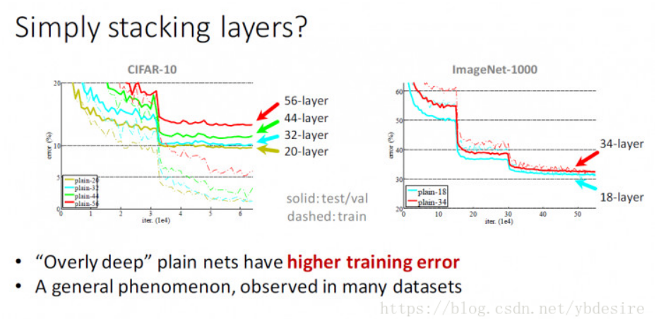
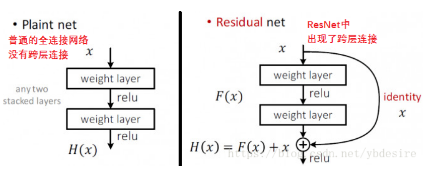
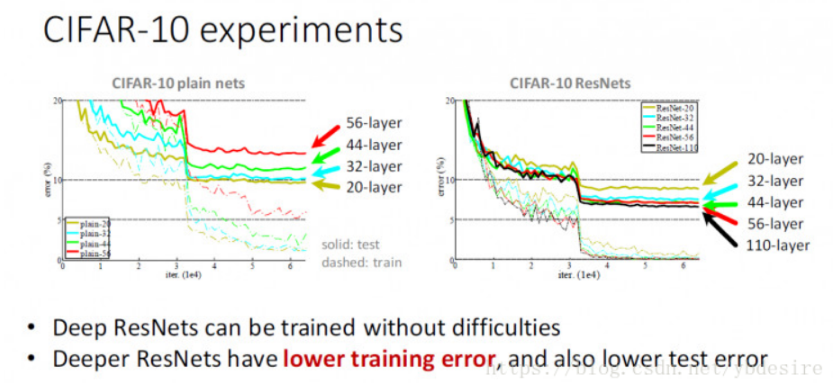

ResNet原理是什么，为什么ResNet能做到那么深？ - ybdesire的专栏 - CSDN博客 https://blog.csdn.net/ybdesire/article/details/80232457

# 1. 引入
非常深的网络，是难以训练的，因为有梯度消失和梯度爆炸的问题存在。

但残差网络（ResNet）却能够做到非常深，2015年，微软亚洲研究院的何凯明等人使用152层的残差网络ResNet参加了当年的ILSVRC，在图像分类、目标检测等任务中的表现大幅超越前一年的比赛的性能水准。

ResNet与其他的深层次网络有什么区别？为什么它能做到这样的效果？

# 2. 普通深层次网络的问题
普通的深层次网络，比如堆叠3x3卷积网络，训练误差如下：

与20层网络相比，56层网络存在更高的训练误差与测试误差。

# 3. ResNet原理

下面是普通全连接网络和ResNet的网络结构对比。

在ResNet中，这个结构单元叫残差块。

1. 可以看到，他们之间最大的区别，就是ResNet的网络结构中出现了跨层连接。
    1. H(x)是任意一种理想的映射
    2. 希望第2类权重层能够与F(x)拟合
    3. 使H(x) = F(x) + x
2. F(x)是一个残差映射w.r.t 恒等
    1. 如果说恒等是理想，很容易将权重值设定为0
    2. 如果理想化映射更接近于恒等映射，便更容易发现微小波动
3. 梯度消失
    1. 神经网络主要的训练方法是BP算法，BP算法的基础是导数的链式法则，也就是多个导数的乘积。
    2. 而sigmoid的导数最大为0.25，且大部分数值都被推向两侧饱和区域，这就导致大部分数值经过sigmoid激活函数之后，其导数都非常小，多个小于等于0.25的数值相乘，其运算结果很小。随着神经网络层数的加深，梯度后向传播到浅层网络时，基本无法引起参数的扰动，也就是没有将loss的信息传递到浅层网络，这样网络就无法训练学习了。这就是所谓的`梯度消失`。
4. `梯度消失的解决方式`主要有
    1. 使用其它激活函数，如ReLU等；
    2. 层归一化；
    3. 优化权重初始化方式；
    4. 构建新颖的网络结构，如highway net，而capsule net意图取消BP学习过程，釜底抽薪。
5. ResNet解决`梯度消失`问题。
    1. 误差升高的原因是网络越深，梯度消失的现象就越明显，所以在后向传播的时候，无法有效的把梯度更新到前面的网络层，靠前的网络层参数无法更新，导致训练和测试效果变差。
    2. ResNet中解决深层网络`梯度消失的问题`的核心结构是`残差网络`：
    3. 残差网络增加了一个identity mapping（恒等映射），把当前输出直接传输给下一层网络（全部是1:1传输，不增加额外的参数），相当于走了一个捷径，跳过了本层运算，这个直接连接命名为`skip connection`
    4. 同时在后向传播过程中，也是将下一层网络的梯度直接传递给上一层网络，这样就解决了深层网络的梯度消失问题。

多个这种残差块结构组成的网络，就是ResNet。ResNet在实际数据集上的表现如下图

可见，在ResNet上，层数越多，训练误差越小。这就是我们想要的理想情况。

# 3. ResNet细节

残差块的结构，是由卷积层和池化层组成的
一般CNN的结构，都是C+C+C+P，依次这样重复，比如：cccpcccpcccp…

# 4. 结论
残差网络结构简单，解决了极深度条件下深度卷积神经网络性能退化的问题，分类性能表现出色。从ILSVRC 2015至今半年多的时间里，残差网络的广泛使用已推进计算机视觉各任务的性能升入新的高度。

# 参考

1. [ResNet网络结构 - 牧野](https://blog.csdn.net/dcrmg/article/details/79263415)
2. [神经网络中的梯度消失](https://www.cnblogs.com/mengnan/p/9480804.html)
3. [对ResNet的理解 - Buyi_Shizi](https://blog.csdn.net/buyi_shizi/article/details/53336192)
4. https://www.leiphone.com/news/201608/vhqwt5eWmUsLBcnv.html
5. https://zhuanlan.zhihu.com/p/22447440
