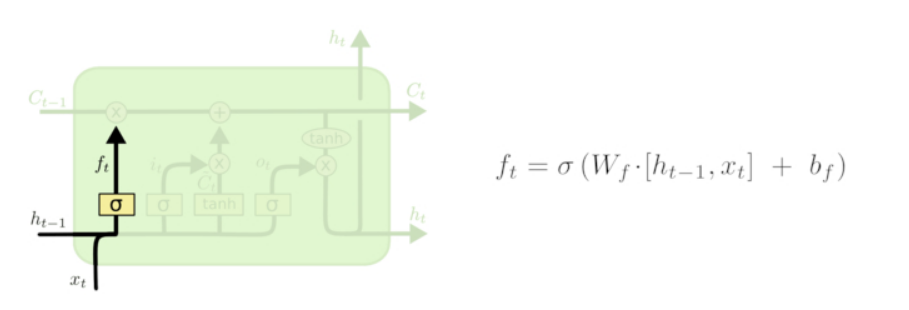

LSTM原理及实现 - gzj_1101的专栏 - CSDN博客 https://blog.csdn.net/gzj_1101/article/details/79376798


## 1. LSTM网络

1. long short term memory，LSTM。
    1. 在标准RNN中，这个重复的结构模块只有一个非常简单的结构，例如一个tanh层。
    2. LSTM 不同于单一神经网络层，有四个。
2. LSTM核心思想
    1. LSTM的关键在于细胞cell(整个绿色的框就是一个 cell)，和穿过细胞的那条水平线。细胞状态类(cell)似于传送带。
    2. 门（gates）可以实现选择性地让信息通过，主要是通过一个 sigmoid 的神经层 和一个逐点相乘的操作来实现的。
        1. 
        2. sigmoid 层输出（是一个向量）的每个元素都是一个在 0 和 1 之间的实数，表示让对应信息通过的权重（或者占比）。
        3. 比如， 0 表示“不让任何信息通过”， 1 表示“让所有信息通过”。
        4. LSTM通过三个这样的本结构来实现信息的保护和控制。这三个门分别输入门、遗忘门和输出门。
3. 逐步理解LSTM
    1. 遗忘门
        1. 决定我们会从细胞状态中丢弃什么信息。
        2. 该门会读取h_{t-1}和x_t，输出一个在 0到 1之间的数值给每个在细胞状态 C_{t-1}中的数字。
        3. 1 表示“完全保留”，0 表示“完全舍弃”。
        4. 
    2. 输入门
        1. 决定让多少新的信息加入到 cell 状态 中来。
        2. 实现这个需要包括两个 步骤：
            1. 首先，一个叫做“input gate layer”的 sigmoid 层决定哪些信息需要更新；
            2. 一个 tanh 层生成一个向量，也就是备选的用来更新的内容，Cˆt
            3. 在下一步，我们把这两部分联合起来，对 cell 的状态进行一个更新。
        3. 
        4. 现在是更新旧细胞状态的时间了，C_{t-1}更新为C_t。前面的步骤已经决定了将会做什么，我们现在就是实际去完成。
            1. 我们把旧状态与 f_t 相乘，丢弃掉我们确定需要丢弃的信息
            2. 接着加上i_t * \tilde{C}_t。这就是新的候选值，根据我们决定更新每个状态的程度进行变化。
            3. 在语言模型的例子中，这就是我们实际根据前面确定的目标，丢弃旧代词的性别信息并添加新的信息的地方。
            4. 
    3. 输出门
        1. 确定输出什么值。这个输出将会基于我们的细胞状态，但是也是一个过滤后的版本。
            1. 首先，我们运行一个 sigmoid 层来确定细胞状态的哪个部分将输出出去。
            2. 接着，我们把细胞状态通过 tanh 进行处理（得到一个在 -1 到 1 之间的值）并将它和 sigmoid 门的输出相乘，
            3. 最终我们仅仅会输出我们确定输出的那部分。
            4. 

## 2. LSTM实现手写数字
这里我们利用的数据集是tensorflow提供的一个手写数字数据集。该数据集是一个包含n张28*28的数据集。

设置LSTM参数

```py
# -*- coding: utf-8 -*-
import tensorflow as tf
from tensorflow.contrib import rnn

import numpy as np
import input_data

# configuration
#                        O * W + b -> 10 labels for each image, O[? 28], W[28 10], B[10]
#                       ^ (O: output 28 vec from 28 vec input)
#                       |
#      +-+  +-+       +--+
#      |1|->|2|-> ... |28| time_step_size = 28
#      +-+  +-+       +--+
#       ^    ^    ...  ^
#       |    |         |
# img1:[28] [28]  ... [28]
# img2:[28] [28]  ... [28]
# img3:[28] [28]  ... [28]
# ...
# img128 or img256 (batch_size or test_size 256)
#      each input size = input_vec_size=lstm_size=28

# configuration variables
input_vec_size = lstm_size = 28 # 输入向量的维度
time_step_size = 28 # 循环层长度

batch_size = 128
test_size = 256

这里设置将batch_size设置为128，time_step_size表示的是lstm神经元的个数，这里设置为28个(和图片的尺寸有关？)，input_vec_size表示一次输入的像素数。

初始化权值参数
def init_weights(shape):
    return tf.Variable(tf.random_normal(shape, stddev=0.01))

def model(X, W, B, lstm_size):
    # X, input shape: (batch_size, time_step_size, input_vec_size)
    # XT shape: (time_step_size, batch_size, input_vec_size)
    #对这一步操作还不是太理解，为什么需要将第一行和第二行置换
    XT = tf.transpose(X, [1, 0, 2])  # permute time_step_size and batch_size,[28, 128, 28]
    # XR shape: (time_step_size * batch_size, input_vec_size)
    XR = tf.reshape(XT, [-1, lstm_size]) # each row has input for each lstm cell (lstm_size=input_vec_size)

    # Each array shape: (batch_size, input_vec_size)
    X_split = tf.split(XR, time_step_size, 0) # split them to time_step_size (28 arrays),shape = [(128, 28),(128, 28)...]
    # Make lstm with lstm_size (each input vector size). num_units=lstm_size; forget_bias=1.0
    lstm = rnn.BasicLSTMCell(lstm_size, forget_bias=1.0, state_is_tuple=True)

    # Get lstm cell output, time_step_size (28) arrays with lstm_size output: (batch_size, lstm_size)
    # rnn..static_rnn()的输出对应于每一个timestep，如果只关心最后一步的输出，取outputs[-1]即可
    outputs, _states = rnn.static_rnn(lstm, X_split, dtype=tf.float32)  # 时间序列上每个Cell的输出:[... shape=(128, 28)..]
    # tanh activation
    # Get the last output
    return tf.matmul(outputs[-1], W) + B, lstm.state_size # State size to initialize the state
```
init_weigths函数利用正态分布随机生成参数的初始值，model的四个参数分别为：X为输入的数据，W表示的是28 * 10的权值(标签为0-9)，B表示的是偏置，维度和W一样。这里首先将一批128*（28*28）的图片放进神经网络。然后进行相关的操作(注释已经写得很明白了，这里就不再赘述)，然后利用WX+B求出预测结果，同时返回lstm的尺寸

训练
py_x, state_size = model(X, W, B, lstm_size)

cost = tf.reduce_mean(tf.nn.softmax_cross_entropy_with_logits(logits=py_x, labels=Y))
train_op = tf.train.RMSPropOptimizer(0.001, 0.9).minimize(cost)
然后通过交叉熵计算误差，反复训练得到最优值。

## 参考资料
1. https://www.jianshu.com/p/9dc9f41f0b29
2. http://blog.csdn.net/Jerr__y/article/details/58598296
3. [Stacked Long Short-Term Memory Networks](https://machinelearningmastery.com/stacked-long-short-term-memory-networks/)
4. 源代码 https://github.com/geroge-gao/deeplearning/tree/master/LSTM