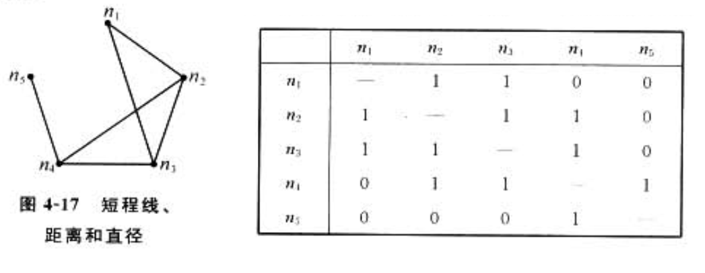
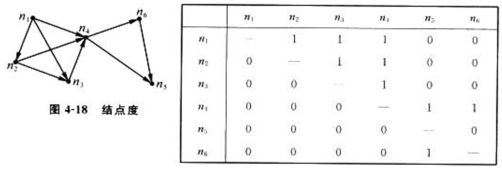

1. 邻接矩阵是指矩阵中的元素 $a_{ij}$ 是从节点i到节点j的边的条数
2. 根据关系是否有方向性，邻接矩阵又分为两类
    1. 若关系无方向，称为对称矩阵






# 根据邻接矩阵生成无向图

```py
import networkx as nx
import matplotlib.pyplot as plt
import numpy as np
 
# 邻接矩阵
G = nx.Graph()
Matrix = np.array(
    [
        [0, 0, 0, 1, 0, 0, 0, 0],  # 1
        [0, 0, 0, 1, 0, 0, 0, 0],  # 2
        [0, 0, 0, 1, 1, 0, 0, 0],  # 3
        [1, 1, 1, 0, 1, 1, 0, 0],  # 4
        [0, 0, 1, 1, 0, 1, 0, 0],  # 5
        [0, 0, 0, 1, 1, 1, 0, 0],  # 6
        [0, 0, 0, 0, 0, 1, 0, 1],  # 7
        [0, 0, 0, 0, 0, 0, 1, 0]  # 8
    ]
)

# 点之间的关系矩阵
N = []
for i in range(len(Matrix)):
    NN = []
    for j in range(len(Matrix)):
        if len(NN) == 0:
            NN.append(i+1)
        if Matrix[i][j] == 1:
            NN.append(j+1)
    N.append(NN)
print (N)

# 无向图
G=nx.Graph()
point=[1,2,3,4,5,6,7,8]
G.add_nodes_from(point)
edglist=[]
for i in range(len(point)):
    for j in range(len(N[i])):
        edglist.append((N[i][0],N[i][j]))
G=nx.Graph(edglist)
position = nx.circular_layout(G)
nx.draw_networkx_nodes(G,position, nodelist=point, node_color="r")
nx.draw_networkx_edges(G,position)
nx.draw_networkx_labels(G,position)
plt.show()
```

# 参考
1. 社会网络分析-理论、方法与应用.林聚任.2009
    1. 4.2矩阵法