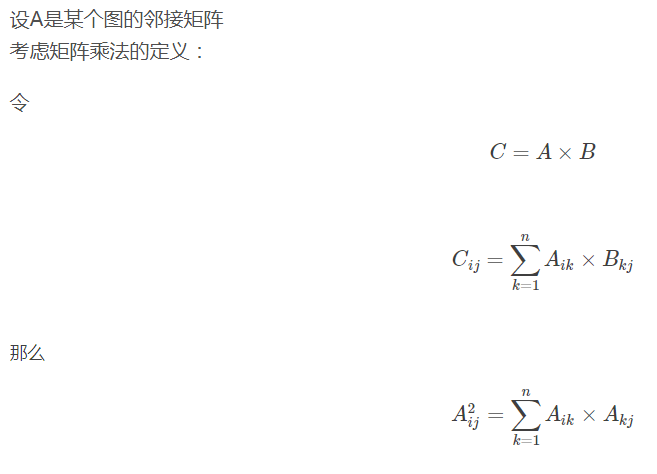

邻接矩阵的幂 - Gorden的博客 - CSDN博客 https://blog.csdn.net/WT_cnyali/article/details/69803030

在图论中，我们可以用0,1的邻接矩阵表示图中边集，或者说点集中两两间的连通性。 
可它毕竟是矩阵，矩阵的乘法要是用到邻接矩阵上，会发生什么呢？ 
它是自己乘自己，所以是幂。

邻接矩阵A中的元素都是用0,1来表示是否联通的，或者说，代表有没有方法从i走到j。那么，$ A_{ik} * A_{kj} $就是表示从i走到k再走到j是否可行。可以发现，$ A^2 $就是取了一个Σ，其实就是统计用2步从i走到j的方法总数。 

考虑累乘的效果，矩阵 $ A^m $ 所代表的意义就是从点与点之间走m步能够到达的方案总数。