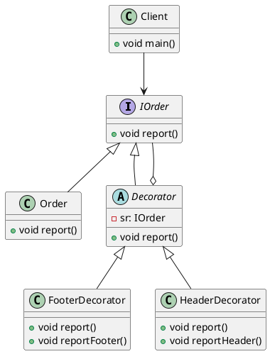

Order 和 Decorator没有直接关系，方便扩展




```java
package work9_3;

public abstract class IOrder {
	public abstract void report();
}
package work9_3;

public class Order extends IOrder {

	public void report() {
		System.out.println("购买 电脑3台，价格为 3000 ￥*3 ");
	}

}
package work9_3;

public abstract class Decorator extends IOrder {

	private IOrder sr;
	
	public Decorator(IOrder sr){
		this.sr = sr;
	}
	
	public void report(){
		this.sr.report();
	}
	
}
package work9_3;

public class FooterDecorator extends Decorator {

	public FooterDecorator(IOrder sr){
		super(sr);
	}
	
	private void reportFooter(){
		System.out.println("打印表尾");
	}
	
	@Override
	public void report(){
		super.report();
		this.reportFooter();
	}
}
package work9_3;

public class HeaderDecorator extends Decorator {

	public HeaderDecorator(IOrder sr){
		super(sr);
	}
	
	private void reportHeader(){
		System.out.println("打印表头");
	}
	
	@Override
	public void report(){
		this.reportHeader();
		super.report();
	}
}
package work9_3;

public class Client {
	
	public static void main(String[] args) {
		IOrder sr;
		sr = new Order();
		sr = new HeaderDecorator(sr);
		sr = new FooterDecorator(sr);
		sr.report();
	}
}

```


## 参考

1. https://github.com/reymont/javapatterns (fork)
2. java与模式.阎宏
3. http://plantuml.com/class-diagram
4. https://blog.csdn.net/a19881029/article/details/8957441