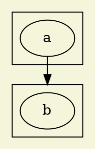

* [学习Graphviz绘图 - 老彭的博客 ](http://itopic.org/graphviz.html)

一、关于Graphviz
1.1 简介

Graphviz （英文：Graph Visualization Software的缩写）是一个由AT&T实验室启动的开源工具包，用于绘制DOT语言脚本描述的图形。它也提供了供其它软件使用的库。Graphviz是一个自由软件，其授权为Eclipse Public License。其Mac版本曾经获得2004年的苹果设计奖[2]。

Graphviz由一种被称为DOT语言的图形描述语言[3] 与一组可以生成和/或处理DOT文件的工具组成：
命令	说明
dot	一个用来将生成的图形转换成多种输出格式的命令行工具。其输出格式包括PostScript，PDF，SVG，PNG，含注解的文本等等。
neato	用于sprint model的生成（在Mac OS版本中称为energy minimized）。
twopi	用于放射状图形的生成
circo	用于圆形图形的生成。
fdp	另一个用于生成无向图的工具。
dotty	一个用于可视化与修改图形的图形用户界面程序。
lefty	一个可编程的(使用一种被EZ影响的语言[4])控件，它可以显示DOT图形，并允许用户用鼠标在图上执行操作。Lefty可以作为MVC模型的使用图形的GUI程序中的视图部分。
官网：http://www.graphviz.org/
官方文档：http://www.graphviz.org/Documentation.php
下载地址：http://www.graphviz.org/Download..php
1.2 DOT语言

DOT语言是一种文本图形描述语言它提供了一种简单的描述图形的方法，并且可以为人类和计算机程序所理解。DOT语言文件通常是具有.gv或是.dot的文件扩展名。很多程序都可以处理DOT文件。
1.3 安装

Mac下直接通过brew install graphviz了，也可以直接从官网下载。

1.4 简单示例

Graphviz画图只需要两步。第一步创建文本文件并命令为x.dot，输入以下内容：

graph demo {
    "Browser" -- {"Chrome", "Fiefox", "Safari", "..."}
}
第二步，使用命令将文本内容转换为图片。

dot demo.dot -T png -o demo.png
-T表示输出类型，可以指定jpg、gif、svg等等，-o指定输出文件名，不指定则输出到标准输出上。执行上面命令后不出意外则可以看到如下效果。


上面是用dot命令来生产，也可以用Graphviz中包含的其他命令来处理dot文本，比如用下面命令渲染出来的图片排列方式则不一样。

neato demo.dot -T png -o demo.png


本文后面的示例都以dot命令来渲染。

1.5 开发工具

可以直接通过上面的这种命令生成，缺点就是看不到实时效果。有一些工具可以实时查看，我这里使用的是vscode的PlantUML插件。Atom、Sublime应该也都有自己的插件，Eclipse上也可以安装PlantUML。Plantuml支持dot需要将开头的@startuml和结尾的@enduml换成@startdot和@enddot，也可以在前面加个//或者#(#@startdot #@enddot)，这样子dot命令生成的时候也不需要额外注释掉该部分。

二、DOT用法
2.1 基本用法

DOT中使用图（digraph/graph/subgraph）、节点（node）和边（edge）来描述关系图/流程图，在配合一些属性的设置完成绘图。看下面例子：

#@startdot

digraph demo {
    label="示例"
    bgcolor="beige"

    node[color="grey"]

    father[label="爸爸", shape="box"]
    mother[label="妈妈", shape="box"]
    brother[label="哥哥", shape="circle"]
    sister[label="姐姐", shape="circle"]
    node[color="#FF6347"]
    strangers[label="路人"]

    edge[color="#FF6347"]

    father->mother[label="夫妻", dir="both"]
    father->brother[label="父子"]
    father->sister[label="父子"]
    father->我[label="父子"]

    mother->{brother,sister,我}[label="母子"]

    {rank=same; father, mother}
    {rank=same; brother,sister,我}
}

#@enddot
说明：

graph 用来描述无向图，关系使用 --来描述，digraph用来描述有向图，关系使用 -> 来描述。
demo为定义的图片名称，label和bgcolor为定义的图片属性。
father、mother、brother、sister、我、strangers为节点。可以把前面4个节点理解成变量定义，比如定义了一个变量father，名字叫爸爸，用方形来渲染，后面所有调用father都会按照方形爸爸来渲染，但这里其实和变量定义是不同的，因为这个节点即便不用也会渲染出来，比如strangers，变量思维为加强理解。比如我没有定义也是可以直接使用的。
描述节点与节点的关系理解为边。边有有向（->）和无向（--）两种。比如father和mother之间的关系为相互的。
上面有两个特殊的节点，node和edge，node用来定义节点的默认属性，edge用来定义边的默认属性。作用域从本次定义到下一次定义截住。特定节点/边设置的属性会覆盖默认值。
[]内属性，属性可以针对图、节点、边来设置。
father 与子女的关系为一条条写的， mother 的关系则为直接通过大括号的方式来对应三个节点。
rank 定义设置节点处在同一行，辅助渲染出来的图的效果。
注释和C语言类似，// 和 # 注释单行， /* */多行注释。
DOT的写法不算严格，比如结束可以有分号，属性可以没有引号。
最后看一下生成的效果图：


该图最基本的关系用一句话就可以表达出来了

{"爸爸", "妈妈"}->{"哥哥", "我", "姐姐"}
2.2 常用属性

2.2.1 常用图属性

属性名	默认值	说明
label		图片标签，如上面示例
bgcolor		背景颜色，颜色文档点此
fontcolor	black	字体颜色，定义上面示例的颜色
fontname	Times-Roman	字体
fontsize	14	字体大小
rank		子图等级限制， same,min,max,source,sink
rankdir	TB	排序方向，LR(left to right) or TB(top to bottom)
compound	false	If true, allow edges between clusters. 配合 lhead 和 ltail 使用
2.2.2 常用节点属性

属性名	默认值	说明
label	node name	节点显示内容
color	black	node边框颜色
fontcolor	black	字体颜色
fillcolor		背景色
fontname	Times-Roman	字体
fontsize	14	字体大小
shape	ellipse	形状,box、ellipse、circle、diamond、plaintext、point、triangle、invtriangle
style		图形样式，eg. bold、dashed、dotted、filled
image		背景图片地址
shape示例

digraph demo {
    bgcolor="floralwhite"
    "box"[shape=box]
    "polygon"[shape=polygon,sides=7] 
    "ellipse"[shape=ellipse]
    "circle"[shape=circle]
    "point"[shape=point]
    "triangle"[shape=triangle]
    "invtriangle"[shape=invtriangle]
    "plaintext"[shape=plaintext]
    "diamond"[shape=diamond]
}


2.2.3 常用边属性

属性名	默认值	说明
label		描述关系
color	black	箭头颜色
fontcolor	black	关系文字颜色
dir	forward	设置方向：forward,back,both,none
arrowhead	normal	箭头头部形状。box、crow、diamond、dot、none、normal、vee。箭头文档点此
arrowtail		箭头尾部形状
arrowsize	1.0	箭头大小
style		图形样式，eg. bold、dashed、dotted、filled
lhead		当 compound 为true时，lhead用于指定边指向的cluster
ltail		与ltail类似
arrowhead示例

digraph demo {
    bgcolor="floralwhite"
    rankdir=LR

    "box"->"crow"[arrowhead=box]
    "crow"->"curve"[arrowhead=crow]
    "curve"->"diamond"[arrowhead=curve]
    "diamond"->"dot"[arrowhead=diamond]
    "dot"->"inv"[arrowhead=dot]
    "inv"->"none"[arrowhead=inv]
    "none"->"normal"[arrowhead=none]
    "normal"->"tee"[arrowhead=normal]
    "tee"->"vee"[arrowhead=tee]
    "vee"->"box"[arrowhead=vee]

    #来个高级的用法
    a->b[arrowhead=lcrowortee]
}


2.3 一些示例

2.3.1 子图

一个图可以包含多个子图，以及子图也可以嵌套子图。子图的名字须为cluster*，否则就直接当节点渲染了。

digraph demo {
    bgcolor="beige"

    subgraph cluster_husband {
        node[color="grey"]
        {"爸爸", "妈妈"} -> "我"
    }

     subgraph cluster_wife {
         {"岳父", "岳母"} -> "老婆"
     }

     "我" -> "老婆"[label="夫妻", dir="both"]
     {rank=same; "我", "老婆"}
}
渲染效果如下：


2.3.2 二叉树形式

digraph demo {
    bgcolor="beige"
    node [shape="record", height=.1]
    node0[label="<f0> | <f1> G | <f2>"]
    node1[label="<f0> | <f1> E | <f2>"]
    node2[label="<f0> | <f1> B | <f2>"]
    node0:f0 -> node1:f1
    node0:f2 -> node2:f1
}
其中，用 | 隔开的串会在绘制出来的节点中展现为一条分隔符，用 <> 括起来的串称为锚点。效果如下：


记录形式的节点也可以是竖形排列的。与横向排列的记录的不同只是label的形式不同，label中内容使用 {} 包围则是竖形排列的。代码如下：

digraph demo {
    bgcolor="beige"
    node [shape="record"]
    a [label="{a | b | c}"]
}


2.3.3 直接指向子图

边直接指向cluster，需要设置 compound 为true，并配合 lhead 或 ltail 来实现。代码如下：

```js
digraph demo {
    bgcolor="beige"
    compound=true
    subgraph cluster0 {
        a
    }
    subgraph cluster1 {
        b
    }
    a -> b [lhead=cluster1];
}
```




Markdown可以让使用者关注内容的书写，不太需要关注文档格式；Graphviz也是一样，让使用者更多的关注内容本身之间的关系而不用太在意展现形式，以文本的方式来绘图也方便进行版本管理。当关系数据量比较大时（比如从数据库读取数据）Graphviz的优势将更明显。

参考文档：

http://www.graphviz.org
http://www.cnblogs.com/billnote/p/4043267.html
http://www.tuicool.com/articles/qeqeuyb

* [Documentation | Graphviz - Graph Visualization Software ](http://www.graphviz.org/Documentation.php)
* [使用Graphviz 画二叉树 - aka_xingwenpeng的专栏 - CSDN博客 ](http://blog.csdn.net/aka_xingwenpeng/article/details/21616021)