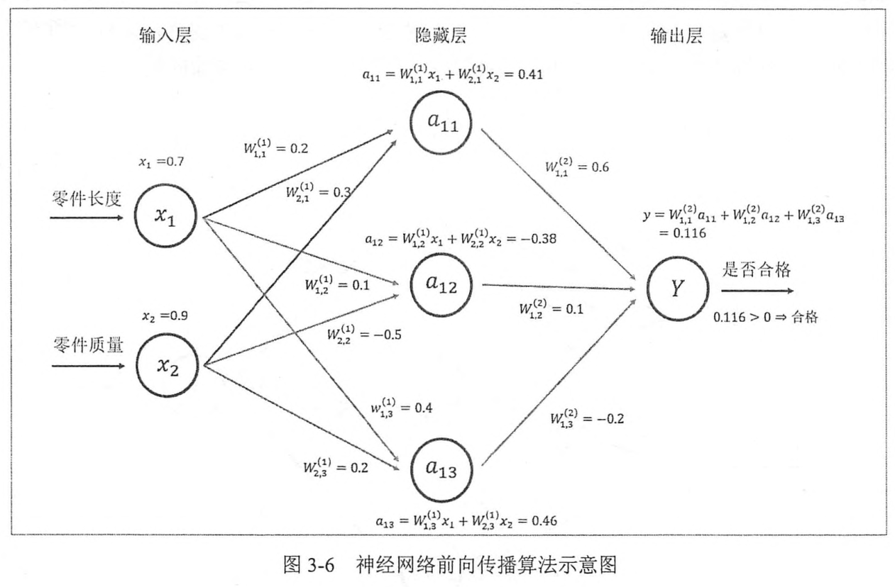

## 1. 神经元

1. 神经元
    1. 神经元是构成一个神经网络的最小单元
    2. 一个最简单的神经元结构的输出就是所有输入的加权和，而不同的输入的权重就是神经元的`参数`
    3. 神经网络的优化过程就是优化神经元中参数取值的过程
2. 全连接
    1. 全连接神经网络是相邻两层之间任意两个节点之间都有链接

## 2. 计算神经网络的前向传播结果需要三部分信息

1. 神经网络的输入
2. 神经网络的连接结构
3. 每个神经元中的参数

## 3. 前向传播算法的过程




## 5. TensorFlow中矩阵乘法

```py
import tensorflowas tf
# 声明变量。
w1 = tf.Variable(tf.random_normal([2, 3], stddev=1, seed=1))
b1 = tf.Variable(tf.constant(0.0, shape=[3]))
w2 = tf.Variable(tf.random_normal([3, 1], stddev=1, seed=1))
b2 = tf.Variable(tf.constant(0.0, shape=[1]))
# 暂时将输入的特征向量定义为一个常量。这里x是一个1*2的矩阵。
x = tf.constant([[0.7, 0.9]])
# 实现神经网络的前向传播过程，并计算神经网络的输出。
a = tf.nn.relu(tf.matmul(x, w1)+b1)
y = tf.nn.relu(tf.matmul(a, w2)+b2)
sess= tf.Session()
# 运行变量初始化过程。
init_op= tf.global_variables_initializer()
sess.run(init_op)
# 输出[[3.95757794]]
print(sess.run(y))
sess.close()
```

## 参考

1. [搭建神经网络](https://www.cnblogs.com/gengyi/p/9813109.html)
2. [全连接网络实战(输入手写数字输出识别结果)](https://www.cnblogs.com/gengyi/p/10073084.html)