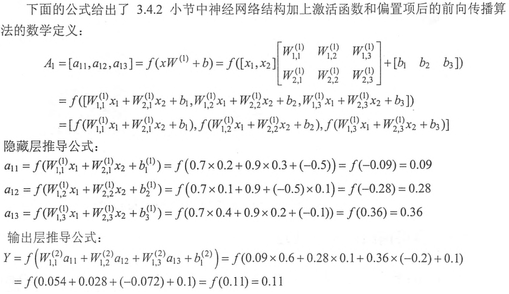

## 1. 激活函数

![激活函数][激活函数.jpg]

1. 神经网络中的每个神经元节点接受上一层神经元的输出值作为本神经元的输入值，并将输入值传递给下一层，输入层神经元节点会将输入属性值直接传递给下一层（隐层或输出层）。
2. 在多层神经网络中，上层节点的输出和下层节点的输入之间具有一个函数关系，这个函数称为激活函数（又称激励函数）

## 2. 激活函数的用途

1. 如果不用激励函数（其实相当于激励函数是f(x) = x），每一层节点的输入都是上层输出的线性函数，无论神经网络有多少层，输出都是输入的线性组合
2. 引入非线性函数作为激励函数，不再是输入的线性组合，而是几乎可以逼近任意函数

## 3. 常见的非线性激活函数

1. TensorFlow提供了7种不同的非线性激活函数，常见的非线性激活函数
    1. tf.nn.relu
    2. tf.sigmoid
    3. tf.tanh
2. tensorflow实现图4-7中神经网络的前向传播算法
    1. a = tf.nn.relu(tf.matmul(x, w1) + biases1)
    2. y = tf.nn.relu(tf.matmul(a, w2) + biases2)



```py
import tensorflowas tf
# 声明变量。
w1 = tf.Variable(tf.random_normal([2, 3], stddev=1, seed=1))
b1 = tf.Variable(tf.constant(0.0, shape=[3]))
w2 = tf.Variable(tf.random_normal([3, 1], stddev=1, seed=1))
b2 = tf.Variable(tf.constant(0.0, shape=[1]))
# 暂时将输入的特征向量定义为一个常量。这里x是一个1*2的矩阵。
x = tf.constant([[0.7, 0.9]])
# 实现神经网络的前向传播过程，并计算神经网络的输出。
a = tf.nn.relu(tf.matmul(x, w1)+b1)
y = tf.nn.relu(tf.matmul(a, w2)+b2)
sess= tf.Session()
# 运行变量初始化过程。
init_op= tf.global_variables_initializer()
sess.run(init_op)
# 输出[[3.95757794]]
print(sess.run(y))
sess.close()
```

## 4. 什么是bias？

* 偏置单元（bias unit），也称为偏置项（bias term）或者截距项（intercept term）
    1. 其实就是函数的截距，与线性方程 y=wx+b 中的 b 的意义是一致的。
    2. 在 y=wx+b中，b表示函数在y轴上的截距，控制着函数偏离原点的距离，其实在神经网络中的偏置单元也是类似的作用。 
    3. 因此，神经网络的参数也可以表示为：(W, b)，其中W表示参数矩阵，b表示偏置项或截距项。

## 5. tf.multiply()和tf.matmul()区别

1. tf.multiply是点乘，即Returns x * y element-wise,支持broadcasting
2. tf.matmul是矩阵乘法，即Multiplies matrix a by matrix b, producing a * b.

```py
import tensorflow as tf
import pprint
a = tf.reshape(tf.constant([1,2,3,4,5,6]), [2,3])
b = tf.reshape(tf.constant([1,2,3,4,5,6]), [3,2])
c = tf.reshape(tf.constant([1,2,3,4,5,6]), [2,3])

x = tf.matmul(a, b)
y = a * c
z = tf.multiply(a,c)

with tf.Session() as sess:
    pprint.pprint(sess.run([a,b,c, x, y,z]))

# 22 = [1,2,3]*[1,3,5]T= 1*1 + 2*3 + 3*5 = 1 + 6 + 15 = 22
# 28 = 1*2 + 2*4 + 3*6 = 2 + 8 + 18 = 28
# 49 = 4*1 + 5*3 + 6*5 = 4 + 15 + 30 = 49
# 64 = 4*2 + 5*4 + 6*6 = 8 + 20 + 36 = 64

# [array([[1, 2, 3],
#        [4, 5, 6]], dtype=int32),
#  array([[1, 2],
#        [3, 4],
#        [5, 6]], dtype=int32),
#  array([[1, 2, 3],
#        [4, 5, 6]], dtype=int32),
#  array([[22, 28],
#        [49, 64]], dtype=int32),
#  array([[ 1,  4,  9],
#        [16, 25, 36]], dtype=int32),
#  array([[ 1,  4,  9],
#        [16, 25, 36]], dtype=int32)]
```

## 参考

1. [常用激活函数（激励函数）理解与总结](https://blog.csdn.net/tyhj_sf/article/details/79932893)
2. [浅谈神经网络中的bias](https://www.cnblogs.com/shuaishuaidefeizhu/p/6832541.html)
3. [神经网络（Representation）](https://blog.csdn.net/walilk/article/details/50278697)
4. [如何实现前向传播过程](https://blog.csdn.net/tcict/article/details/77643619)
5. [tf.multiply()和tf.matmul()区别 ](https://blog.csdn.net/tcx1992/article/details/80346357)