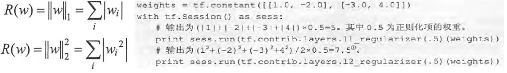

## 1. 过拟合

* 过拟合
    1. 当一个模型过为复杂之后，它可以很好的“记忆”每一个训练数据中随机噪音的部分而忘记要去“学习”训练数据中通用的趋势
    2. 过度拟合了训练数据中的噪音而忽视了问题的整体规律

## 2. 正则化

1. 思想
    1. 正则化的思想就是在损失函数中`加入刻画模型复杂程度的指标`
    2. 通过限制权重的大小，使得模型不能任意拟合训练数据中的随机噪音
2. 种类
    1. L1正则化
        1. 让参数变得更稀疏。会有更多的参数变成0
        2. L1正则化的计算公式不可导
    2. L2正则化
        1. 不会让参数变得稀疏
        2. 可导

## 3. L2正则化的损失函数

```py
w = tf.Variable(tf.random_normal([2, 1], stddev=1, seed=1))
y = tf.matmul(x, w)

# loss由两部分组成，第一部分为4.2.1小结总的均方误差损失函数
# 第二部分是正则化，防止模型过度模拟训练数据中的随机噪音
# lambda参数表示了正则化项的权重
loss = tf.reduce_mean(tf.square(y_ - y)) + tf.contrib.layers.l2_regularizer(lambda)(w)
```



## 4. 集合计算5层神经网络带L2正则化的损失函数

```py
import tensorflow as tf

# 获取一层神经网络边上的权重，并将整个权重的L2这个正则化损失加入名称为'losses'的集合中
def get_weight(shape, var_lambda):
    w = tf.Variable(tf.random_normal(shape), dtype=tf.float32)
    tf.add_to_collection('losses', tf.contrib.layers.l2_regularizer(var_lambda)(w))
    return w

x = tf.placeholder(tf.float32, shape=(None, 2))
y_ = tf.placeholder(tf.float32, shape=(None, 1))

# 每层节点的个数
layer_dimension = [2,10,5,3,1]
# 神经网络的层数
n_layers = len(layer_dimension)

cur_layer = x
in_dimension = layer_dimension[0]

# 循环生成网络结构，输入层X[None, 2]，隐藏层W1[2, 10]、W2[10, 5]、W3[5, 3]，输出层Y[None, 1]
for i in range(1, n_layers):
    out_dimension = layer_dimension[i]
    weight = get_weight([in_dimension, out_dimension], 0.003)
    bias = tf.Variable(tf.constant(0.1, shape=[out_dimension]))
    cur_layer = tf.nn.elu(tf.matmul(cur_layer, weight) + bias)
    in_dimension = layer_dimension[i]

y= cur_layer

# 损失函数的定义。
mse_loss = tf.reduce_sum(tf.pow(y_ - y, 2)) / dataset_size
tf.add_to_collection('losses', mse_loss)
loss = tf.add_n(tf.get_collection('losses'))
```