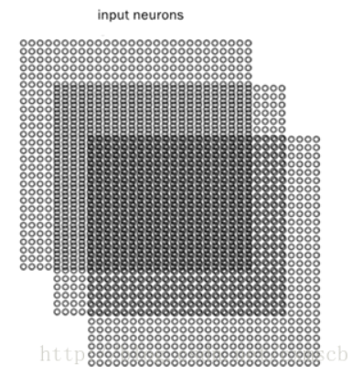
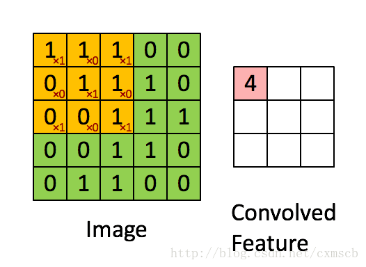
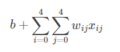
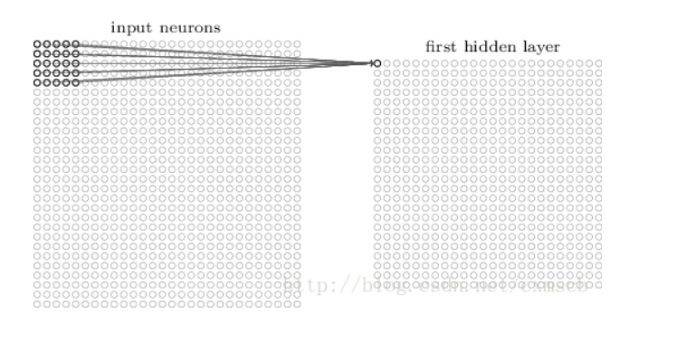
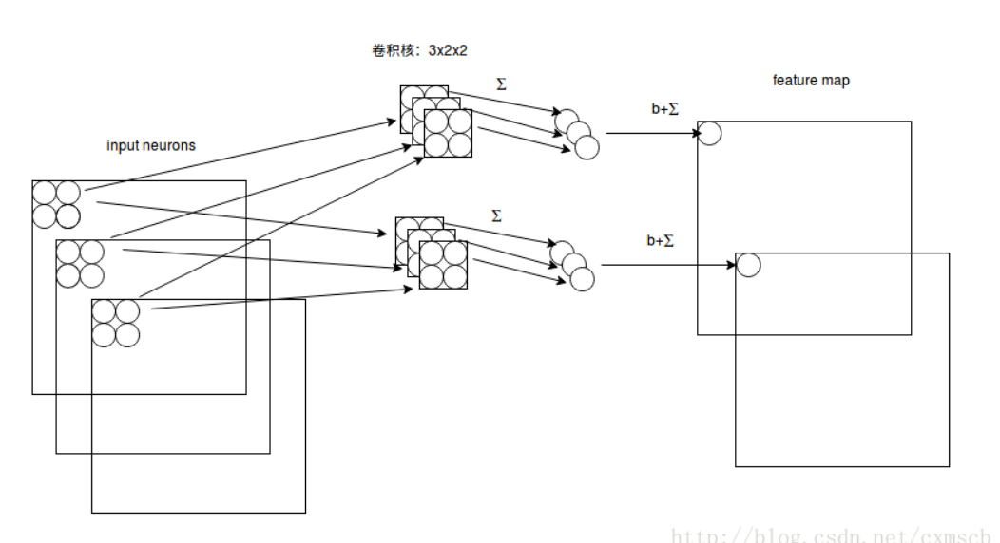
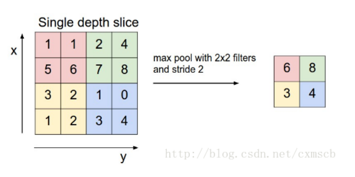

深度学习之卷积神经网络CNN及tensorflow代码实现示例 - cxmscb的博客 - CSDN博客 https://blog.csdn.net/cxmscb/article/details/71023576

# 1. CNN的引入

1. 人工的全连接神经网络
    1. 每相邻两层之间的每个神经元之间都是有边相连的
    2. 当输入层的特征维度变得很高时，这时全连接网络需要训练的参数就会增大很多，计算速度就会变得很慢
    3. 例如一张黑白的 28×2828×28 的手写数字图片，输入层的神经元就有784个
        1. 若在中间只使用一层隐藏层，参数 ww 就有 784×15=11760784×15=11760 多个；
        2. 若输入的是28×28带有颜色的RGB格式的手写数字图片，输入神经元就有28×28×3=235 个…… 。


2. 卷积神经网络（Convolutional Neural Network,CNN）
    1. 卷积层的神经元只与前一层的部分神经元节点相连，即它的神经元间的连接是非全连接的，
    2. 且同一层中某些神经元之间的连接的权重 w 和偏移 b 是共享的（即相同的）
    3. 这样大量地减少了需要训练参数的数量。

2. 卷积神经网络CNN的结构一般包含这几个层：
    1. 输入层：用于数据的输入
    2. 卷积层：使用卷积核进行特征提取和特征映射
    3. 激励层：由于卷积也是一种线性运算，因此需要增加非线性映射
    4. 池化层：进行下采样，对特征图稀疏处理，减少数据运算量。
    5. 全连接层：通常在CNN的尾部进行重新拟合，减少特征信息的损失
    6. 输出层：用于输出结果
3. 当然中间还可以使用一些其他的功能层:
    1. 归一化层（Batch Normalization）：在CNN中对特征的归一化
    2. 切分层：对某些（图片）数据的进行分区域的单独学习
    3. 融合层：对独立进行特征学习的分支进行融合

# 2. CNN的层次结构

1. 输入层
    1. CNN 数据输入的格式 与 全连接神经网络的输入格式（一维向量）不太一样
    2. CNN的输入层的输入格式保留了图片本身的结构。
        1. 对于黑白的 28×2828×28 的图片，CNN的输入是一个 28×2828×28 的的二维神经元
            1. 
        2. 而对于RGB格式的28×2828×28图片，CNN的输入则是一个 3×28×283×28×28 的三维神经元（RGB中的每一个颜色通道都有一个 28×2828×28 的矩阵）
            2. 
2. 卷积层：
    1. local receptive fields（感受视野）
        1. 
        2. 假设输入的是一个 28×2828×28 的的二维神经元
        3. 定义5×5区域(感受视野)，隐藏层的神经元与输入层的5×5个神经元相连
        4. 隐藏层中的神经元 具有一个固定大小的感受视野去感受上一层的部分特征
        5. 在全连接神经网络中，隐藏层中的神经元的感受视野足够大乃至可以看到上一层的所有特征。
        6. 在卷积神经网络中，隐藏层中的神经元的感受视野比较小，只能看到上一次的部分特征
        7. 上一层的其他特征可以通过平移感受视野来得到同一层的其他神经元，由同一层其他神经元来看
        8. 设移动的步长为1：从左到右扫描，每次移动 1 格，扫描完之后，再向下移动一格，再次从左到右扫描
        9. 
        10. 可看出 卷积层的神经元是只与前一层的部分神经元节点相连，每一条相连的线对应一个权重 w 。
        11. 
        12. 对下一层的所有神经元来说，它们从不同的位置去探测了上一层神经元的特征。
    2. shared weights（共享权值）
    3. 卷积核
        1. 一个感受视野带有一个卷积核，我们将 感受视野 中的权重 w 矩阵称为 卷积核 ；
        2. 将感受视野对输入的扫描间隔称为步长（stride）；
        3. 当步长比较大时（stride>1），为了扫描到边缘的一些特征，感受视野可能会“出界”，
        4. 这时需要对边界扩充(pad)，边界扩充可以设为 00 或 其他值。步长 和 边界扩充值的大小由用户来定义。
        5. 卷积核的大小由用户来定义，即定义的感受视野的大小；
        6. 卷积核的权重矩阵的值，便是卷积神经网络的参数，
        7. 为了有一个偏移项 ，卷积核可附带一个偏移项 b ，它们的初值可以随机来生成，可通过训练进行变化。
    4. feature map (特征映射图)
        1. 一个带有卷积核的感受视野 扫描生成的下一层神经元矩阵 称为 一个feature map (特征映射图)
        2. 
        3. 在同一个 feature map 上的神经元使用的卷积核是相同的，
        4. 这些神经元 shared weights，共享卷积核中的权值和附带的偏移。
        5. 一个 feature map 对应 一个卷积核，若我们使用 3 个不同的卷积核，可以输出3个feature map：（感受视野：5×5，步长stride：1）
        6. 因此在CNN的卷积层，我们需要训练的参数大大地减少到了 (5×5+1)×3=78个。
        7. 
        8. 假设输入的是 28×28 的RGB图片，即输入的是一个 3×28×28 的的二维神经元，这时卷积核的大小不只用长和宽来表示，还有深度，感受视野也对应的有了深度
        9. 
        10. 由图可知：感受视野： 3×2×2；卷积核：3×2×2，深度为3；
        11. 卷积核的深度和感受视野的深度相同，都由输入数据来决定，长宽可由自己来设定，数目也可以由自己来设定
        12. 一个卷积核依然对应一个 feature map 。
        13. “stride=1”表示在长和宽上的移动间隔都为1
    5. 激励层：
        1. 激励层主要对卷积层的输出进行一个非线性映射，因为卷积层的计算还是一种线性计算。
        2. 使用的激励函数一般为ReLu函数
        3. 卷积层和激励层通常合并在一起称为“卷积层”
    6. 池化层：
        1. 当输入经过卷积层时，若感受视野比较小，布长stride比较小，得到的feature map （特征图）还是比较大
        2. 可以通过池化层来对每一个 feature map 进行降维操作，输出的深度还是不变的，依然为 feature map 的个数
        3. 池化层也有一个“池化视野（filter）”来对feature map矩阵进行扫描，对“池化视野”中的矩阵值进行计算，一般有两种计算方式：
            1. Max pooling：取“池化视野”矩阵中的最大值
            2. Average pooling：取“池化视野”矩阵中的平均值
        4. 扫描的过程中同样地会涉及的扫描布长stride，扫描方式同卷积层一样，先从左到右扫描，结束则向下移动布长大小，再从左到右
        5. 
        6. 其中“池化视野”filter： 2×2；步长stride：2。（注：“ 池化视野”为个人叫法）
        7. 最后可将 3 个 24×2424×24 的 feature map 下采样得到 3 个 24×2424×24 的特征矩阵：
        8. 
    7. 归一化层：
        1. Batch Normalization
            1. Batch Normalization（批量归一化）实现了在神经网络层的中间进行预处理的操作，
            2. 即在上一层的输入归一化处理后再进入网络的下一层，这样可有效地防止“梯度弥散”，加速网络训练。
            3. Batch Normalization具体的算法如下图所示：


每次训练时，取 batch_size 大小的样本进行训练，在BN层中，将一个神经元看作一个特征，batch_size 个样本在某个特征维度会有 batch_size 个值，然后在每个神经元 xixi 维度上的进行这些样本的均值和方差，通过公式得到 xi∧xi∧，再通过参数 γγ 和 ββ 进行线性映射得到每个神经元对应的输出 yiyi 。在BN层中，可以看出每一个神经元维度上，都会有一个参数 γγ 和 ββ ，它们同权重ww一样可以通过训练进行优化。

在卷积神经网络中进行批量归一化时，一般对 未进行ReLu激活的 feature map进行批量归一化，输出后再作为激励层的输入，可达到调整激励函数偏导的作用。

一种做法是将 feature map 中的神经元作为特征维度，参数 γγ 和 ββ 的数量和则等于 2×fmapwidth×fmaplength×fmapnum2×fmapwidth×fmaplength×fmapnum，这样做的话参数的数量会变得很多；

另一种做法是把 一个 feature map 看做一个特征维度，一个 feature map 上的神经元共享这个 feature map的 参数 γγ 和 ββ ，参数 γγ 和 ββ 的数量和则等于 2×fmapnum2×fmapnum，计算均值和方差则在batch_size个训练样本在每一个feature map维度上的均值和方差。

注：fmapnumfmapnum指的是一个样本的feature map数量，feature map 跟神经元一样也有一定的排列顺序。

Batch Normalization 算法的训练过程和测试过程的区别：

在训练过程中，我们每次都会将 batch_size 数目大小的训练样本 放入到CNN网络中进行训练，在BN层中自然可以得到计算输出所需要的 均值 和 方差 ;

而在测试过程中，我们往往只会向CNN网络中输入一个测试样本，这是在BN层计算的均值和方差会均为 0，因为只有一个样本输入，因此BN层的输入也会出现很大的问题，从而导致CNN网络输出的错误。所以在测试过程中，我们需要借助训练集中所有样本在BN层归一化时每个维度上的均值和方差，当然为了计算方便，我们可以在 batch_num 次训练过程中，将每一次在BN层归一化时每个维度上的均值和方差进行相加，最后再进行求一次均值即可。

### 2.6.2. Local Response Normalization
近邻归一化(Local Response Normalization)的归一化方法主要发生在不同的相邻的卷积核（经过ReLu之后）的输出之间，即输入是发生在不同的经过ReLu之后的 feature map 中。

LRN的公式如下：

b(i,x,y)=a(i,x,y)(k+α∑min(N−1,i+n/2)j=max(0,i−n/2)a(j,x,y)2) β
b(i,x,y)=a(i,x,y)(k+α∑j=max(0,i−n/2)min(N−1,i+n/2)a(j,x,y)2) β
其中： 
a(i,x,y)a(i,x,y) 表示第ii个卷积核的输出（经过ReLu层）的feature map上的 (x，y)(x，y) 位置上的值。 
b(i,x,y)b(i,x,y) 表示 a(i,x,y)a(i,x,y) 经LRN后的输出。 
NN 表示卷积核的数量，即输入的 feature map的个数。 
nn 表示近邻的卷积核（或feature map）个数，由自己来决定。 
k,α,βk,α,β是超参数，由用户自己调整或决定。

与BN的区别：BN依据mini batch的数据,近邻归一仅需要自己来决定，BN训练中有学习参数;BN归一化主要发生在不同的样本之间，LRN归一化主要发生在不同的卷积核的输出之间。

## 2.7 切分层：
在一些应用中,需要对图片进行切割，独立地对某一部分区域进行单独学习。这样可以对特定部分进行通过调整 感受视野 进行力度更大的学习。

## 2.8 融合层：
融合层可以对切分层进行融合，也可以对不同大小的卷积核学习到的特征进行融合。

例如在GoogleLeNet 中，使用多种分辨率的卷积核对目标特征进行学习，通过 padding 使得每一个 feature map 的长宽都一致，之后再将多个 feature map 在深度上拼接在一起： 


融合的方法有几种，一种是特征矩阵之间的拼接级联，另一种是在特征矩阵进行运算 (+,−,x,max,conv)(+,−,x,max,conv)。

## 2.9 全连接层和输出层
全连接层主要对特征进行重新拟合，减少特征信息的丢失；输出层主要准备做好最后目标结果的输出。例如VGG的结构图，如下图所示： 


# 3. 典型的卷积神经网络
## 3.1 LeNet-5模型
第一个成功应用于数字数字识别的卷积神经网络模型（卷积层自带激励函数，下同）：


卷积层的卷积核边长都是5，步长都为1；池化层的窗口边长都为2，步长都为2。

## 3.2 AlexNet 模型
具体结构图：


从AlexNet的结构可发现：经典的卷积神经网络结构通常为：

输入层 → (卷积层+→池化层？)+→全连接层+→输出层
输入层 → (卷积层+→池化层？)+→全连接层+→输出层
AlexNet卷积层的卷积核边长为5或3，池化层的窗口边长为3。具体参数如图所示：


## 3.3 VGGNet 模型
VGGNet 模型 和 AlexNet模型 在结构上没多大变化，在卷积层部位增加了多个卷积层。AlexNet（上） 和 VGGNet （下）的对比如下图所示：


具体参数如图所示：其中CONV3-64：表示卷积核的长和宽为3，个数有64个；POOL2：表示池化窗口的长和宽都为2，其他类似。 


## 3.3 GoogleNet 模型
使用了多个不同分辨率的卷积核，最后再对它们得到的feature map 按深度融合在一起，结构如图：


其中，有一些主要的模块称为 Inception module，例如： 


在 Inception module 中使用到了很多 1×11×1 的卷积核，使用 1×11×1 的卷积核，步长为1时，输入的feature map和输出的feature map长宽不会发生改变，但可以通过改变 1×11×1 的卷积核的数目，来达到减小feature map的厚度的效果，从而做到一些训练参数的减少。

GoogleNet还有一个特点就是它是全卷积结构（FCN）的，网络的最后没有使用全连接层，一方面这样可以减少参数的数目，不容易过拟合，一方面也带来了一些空间信息的丢失。代替全连接层的是全局平均池化（Global Average Pooling，GAP）的方法，思想是：为每一个类别输出一个 feature map ，再取每一个 feature map上的平均值，作为最后的softmax层的输入。

## 3.5 ResNet模型
在前面的CNN模型中，都是将输入一层一层地传递下去（图左），当层次比较深时，模型不是很好训练。在ResNet模型中，它将低层学习到的特征和高层的学习到的特征进行一个融合（加法运算,图右），这样反向传递时，导数传递得更快，减少梯度弥散的现象。

注意：F（X）的shape需要等于 X 的shape ，这样才可以进行相加。


# 四、Tensorflow代码
主要的函数说明：
卷积层： 
tf.nn.conv2d(input, filter, strides, padding, use_cudnn_on_gpu=None, data_format=None, name=None)

参数说明：
data_format：表示输入的格式，有两种分别为：“NHWC”和“NCHW”，默认为“NHWC”

input：输入是一个4维格式的（图像）数据，数据的 shape 由 data_format 决定：当 data_format 为“NHWC”输入数据的shape表示为[batch, in_height, in_width, in_channels]，分别表示训练时一个batch的图片数量、图片高度、 图片宽度、 图像通道数。当 data_format 为“NHWC”输入数据的shape表示为[batch, in_channels， in_height, in_width]

filter：卷积核是一个4维格式的数据：shape表示为：[height,width,in_channels, out_channels]，分别表示卷积核的高、宽、深度（与输入的in_channels应相同）、输出 feature map的个数（即卷积核的个数）。

strides：表示步长：一个长度为4的一维列表，每个元素跟data_format互相对应，表示在data_format每一维上的移动步长。当输入的默认格式为：“NHWC”，则 strides = [batch , in_height , in_width, in_channels]。其中 batch 和 in_channels 要求一定为1，即只能在一个样本的一个通道上的特征图上进行移动，in_height , in_width表示卷积核在特征图的高度和宽度上移动的布长，即 strideheightstrideheight 和 stridewidthstridewidth 。

padding：表示填充方式：“SAME”表示采用填充的方式，简单地理解为以0填充边缘，当stride为1时，输入和输出的维度相同；“VALID”表示采用不填充的方式，多余地进行丢弃。具体公式：

“SAME”: output_spatial_shape[i]=⌈(input_spatial_shape[i] / strides[i])⌉output_spatial_shape[i]=⌈(input_spatial_shape[i] / strides[i])⌉
“VALID”: output_spatial_shape[i]=⌈((input_spatial_shape[i]−(spatial_filter_shape[i]−1)/strides[i])⌉output_spatial_shape[i]=⌈((input_spatial_shape[i]−(spatial_filter_shape[i]−1)/strides[i])⌉
池化层： 
tf.nn.max_pool( value, ksize,strides,padding,data_format=’NHWC’,name=None) 
或者 
tf.nn.avg_pool(…)

参数说明：
value：表示池化的输入：一个4维格式的数据，数据的 shape 由 data_format 决定，默认情况下shape 为[batch, height, width, channels]

其他参数与 tf.nn.cov2d 类型

ksize：表示池化窗口的大小：一个长度为4的一维列表，一般为[1, height, width, 1]，因不想在batch和channels上做池化，则将其值设为1。

Batch Nomalization层： 
batch_normalization( x,mean,variance,offset,scale, variance_epsilon,name=None)

mean 和 variance 通过 tf.nn.moments 来进行计算： 
batch_mean, batch_var = tf.nn.moments(x, axes = [0, 1, 2], keep_dims=True)，注意axes的输入。对于以feature map 为维度的全局归一化，若feature map 的shape 为[batch, height, width, depth]，则将axes赋值为[0, 1, 2]

x 为输入的feature map 四维数据，offset、scale为一维Tensor数据，shape 等于 feature map 的深度depth。

代码示例：
通过搭建卷积神经网络来实现sklearn库中的手写数字识别，搭建的卷积神经网络结构如下图所示： 

```py
import tensorflow as tf
from sklearn.datasets import load_digits
import numpy as np

digits = load_digits()
X_data = digits.data.astype(np.float32)
Y_data = digits.target.astype(np.float32).reshape(-1,1)
print X_data.shape
print Y_data.shape
(1797, 64)
(1797, 1)

from sklearn.preprocessing import MinMaxScaler
scaler = MinMaxScaler()
X_data = scaler.fit_transform(X_data)

from sklearn.preprocessing import OneHotEncoder
Y = OneHotEncoder().fit_transform(Y_data).todense() #one-hot编码
matrix([[ 1.,  0.,  0., ...,  0.,  0.,  0.],
        [ 0.,  1.,  0., ...,  0.,  0.,  0.],
        [ 0.,  0.,  1., ...,  0.,  0.,  0.],
        ..., 
        [ 0.,  0.,  0., ...,  0.,  1.,  0.],
        [ 0.,  0.,  0., ...,  0.,  0.,  1.],
        [ 0.,  0.,  0., ...,  0.,  1.,  0.]])
# 转换为图片的格式 （batch，height，width，channels）
X = X_data.reshape(-1,8,8,1)
batch_size = 8 # 使用MBGD算法，设定batch_size为8
def generatebatch(X,Y,n_examples, batch_size):
    for batch_i in range(n_examples // batch_size):
        start = batch_i*batch_size
        end = start + batch_size
        batch_xs = X[start:end]
        batch_ys = Y[start:end]
        yield batch_xs, batch_ys # 生成每一个batch

tf.reset_default_graph()
# 输入层
tf_X = tf.placeholder(tf.float32,[None,8,8,1])
tf_Y = tf.placeholder(tf.float32,[None,10])

# 卷积层+激活层
conv_filter_w1 = tf.Variable(tf.random_normal([3, 3, 1, 10]))
conv_filter_b1 =  tf.Variable(tf.random_normal([10]))
relu_feature_maps1 = tf.nn.relu(\
                tf.nn.conv2d(tf_X, conv_filter_w1,strides=[1, 1, 1, 1], padding='SAME') + conv_filter_b1)

# 池化层
max_pool1 = tf.nn.max_pool(relu_feature_maps1,ksize=[1,3,3,1],strides=[1,2,2,1],padding='SAME')

print max_pool1

Tensor("MaxPool:0", shape=(?, 4, 4, 10), dtype=float32)

# 卷积层
conv_filter_w2 = tf.Variable(tf.random_normal([3, 3, 10, 5]))
conv_filter_b2 =  tf.Variable(tf.random_normal([5]))
conv_out2 = tf.nn.conv2d(relu_feature_maps1, conv_filter_w2,strides=[1, 2, 2, 1], padding='SAME') + conv_filter_b2
print conv_out2

Tensor("add_4:0", shape=(?, 4, 4, 5), dtype=float32)

# BN归一化层+激活层 
batch_mean, batch_var = tf.nn.moments(conv_out2, [0, 1, 2], keep_dims=True)
shift = tf.Variable(tf.zeros([5]))
scale = tf.Variable(tf.ones([5]))
epsilon = 1e-3
BN_out = tf.nn.batch_normalization(conv_out2, batch_mean, batch_var, shift, scale, epsilon)
print BN_out
relu_BN_maps2 = tf.nn.relu(BN_out)

Tensor("batchnorm/add_1:0", shape=(?, 4, 4, 5), dtype=float32)
# 池化层
max_pool2 = tf.nn.max_pool(relu_BN_maps2,ksize=[1,3,3,1],strides=[1,2,2,1],padding='SAME')

print max_pool2
Tensor("MaxPool_1:0", shape=(?, 2, 2, 5), dtype=float32)
# 将特征图进行展开
max_pool2_flat = tf.reshape(max_pool2, [-1, 2*2*5])
# 全连接层
fc_w1 = tf.Variable(tf.random_normal([2*2*5,50]))
fc_b1 =  tf.Variable(tf.random_normal([50]))
fc_out1 = tf.nn.relu(tf.matmul(max_pool2_flat, fc_w1) + fc_b1)
# 输出层
out_w1 = tf.Variable(tf.random_normal([50,10]))
out_b1 = tf.Variable(tf.random_normal([10]))
pred = tf.nn.softmax(tf.matmul(fc_out1,out_w1)+out_b1)

loss = -tf.reduce_mean(tf_Y*tf.log(tf.clip_by_value(pred,1e-11,1.0)))

train_step = tf.train.AdamOptimizer(1e-3).minimize(loss)

y_pred = tf.arg_max(pred,1)
bool_pred = tf.equal(tf.arg_max(tf_Y,1),y_pred)

accuracy = tf.reduce_mean(tf.cast(bool_pred,tf.float32)) # 准确率

with tf.Session() as sess:
    sess.run(tf.global_variables_initializer())
    for epoch in range(1000): # 迭代1000个周期
        for batch_xs,batch_ys in generatebatch(X,Y,Y.shape[0],batch_size): # 每个周期进行MBGD算法
            sess.run(train_step,feed_dict={tf_X:batch_xs,tf_Y:batch_ys})
        if(epoch%100==0):
            res = sess.run(accuracy,feed_dict={tf_X:X,tf_Y:Y})
            print (epoch,res)
    res_ypred = y_pred.eval(feed_dict={tf_X:X,tf_Y:Y}).flatten() # 只能预测一批样本，不能预测一个样本
    print res_ypred
(0, 0.36338341)
(100, 0.96828049)
(200, 0.99666113)
(300, 0.99554813)
(400, 0.99888706)
(500, 0.99777406)
(600, 0.9961046)
(700, 0.99666113)
(800, 0.99499166)
(900, 0.99888706)
[0 1 2 ..., 8 9 8]
```
在第100次个batch size 迭代时，准确率就快速接近收敛了，这得归功于Batch Normalization 的作用！需要注意的是，这个模型还不能用来预测单个样本，因为在进行BN层计算时，单个样本的均值和方差都为0，会得到相反的预测效果，解决方法详见归一化层。

```py
from sklearn.metrics import  accuracy_score
print accuracy_score(Y_data,res_ypred.reshape(-1,1))
0.998887033945
```