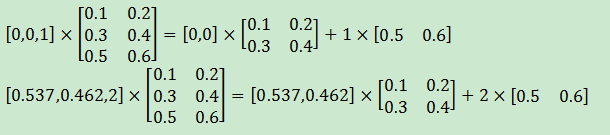

## 1. 霍普菲尔德网络

* 循环神经网络(recurrent neural network, RNN)源自于霍普菲尔德网络。
* 循环神经网络挖掘数据中的时序信息以及语义信息的深度表达能力被充分利用，并在语音识别、语言模型、机器翻译以及时序分析等方面实现了突破。

## 2. 循环神经网络的主要用途是处理和预测序列数据

* 循环神经网络会记忆之前的信息，并利用之前的信息影响后面结点的输出。
* 循环神经网络的隐含层之间的结点是有连接的，隐含层的输入不仅包括输入层的输出，还包括上一时刻隐含层的输出

## 3. 循环神经网络会对于每一个时刻的输入结合当前模型的状态给出一个输出

* 循环神经网络在每一个时刻会有一个输入Xt，然后根据循环神经网络当前的状态At提供一个输出Ht，而循环神经网络当前的状态At是根据上一时刻状态At-1和当前的输入Xt共同决定的。
* 循环神经网络要求每一个时刻都有一个输入，但是不一定每个时刻都需要有输出

## 4. 零偏特性

1. 如果一个函数的输入均值为零，输出均值也为0。就称为具有零偏特性。比如tanh(x)
    1. 4.1深度学习与深层神经网络

## 5. 循环体

* 被复制多次的结构被称之为循环体
* 循环体网络结构中的参数在不同时刻是共享的

## 6. 一个使用最简单的循环体结构的循环神经网络

* 循环神经网络中的状态是通过一个向量来表示的
    * [矩阵、向量、行列式、特征值与特征向量](https://blog.csdn.net/a727911438/article/details/77531973)
* 向量的维度也称为循环神经网络隐含层的大小，假设为h
* 假设输入向量的维度为x，那么循环体的全连接层神经网络的输入大小为h+x
  * 将上一时刻的状态与当前时刻的输入拼接成一个大的向量作为循环体中神经网络的输入
* 因为该神经网络的输出为当前时刻的状态，于是输出层的节点个数也为h，循环体中的参数个数为(h+x)*h+h
* 循环神经网络还需要一个全连接神经网络将当前时刻的状态转化为最终的输出

## 7. 循环神经网络的前向传播的计算过程




```py
X = [1,2]
state = [0.0, 0.0]
w_cell_state = np.asarray([[0.1, 0.2], [0.3, 0.4]])
w_cell_input = np.asarray([0.5, 0.6])
b_cell = np.asarray([0.1, -0.1])
w_output = np.asarray([[1.0], [2.0]])
b_output = 0.1

print (np.dot(state, w_cell_state) + X[0] * w_cell_input)
print (np.dot(state, w_cell_state) + X[0] * w_cell_input + b_cell) 
print ("state 1:",np.tanh(np.dot(state, w_cell_state) + X[0] * w_cell_input + b_cell))
print (np.dot((np.tanh(np.dot(state, w_cell_state) + X[0] * w_cell_input + b_cell)), w_output))

for i in range(len(X)):
    before_activation = np.dot(state, w_cell_state) + X[i] * w_cell_input + b_cell
    state = np.tanh(before_activation)
    final_output = np.dot(state, w_output) + b_output
    print "before activation: ", before_activation
    print "state: ", state
    print "output: ", final_output
```


## 8. 序列过长

* 梯度消散
    1. 序列过长会导致优化时出现梯度消散的问题(the vanishing gradient problem)，
    2. 实际中一般会规定一个最大长度，当序列长度超过规定长度之后会对序列进行截断

## 9. static_rnn

1. Aliases:
    1. tf.contrib.rnn.static_rnn
    2. tf.nn.static_rnn
2. 使用指定的RNN神经元创建循环神经网络
    tf.nn.static_rnn(
        cell,
        inputs,
        initial_state=None,
        dtype=None,
        sequence_length=None,
        scope=None
    )
3. 参数说明：
    1. cell:用于神经网络的RNN神经元,如BasicRNNCell,BasicLSTMCell
    2. inputs:一个长度为T的list,list中的每个元素为一个Tensor，Tensor形如：[batch_size,input_size]
    3. initial_state:RNN的初始状态，如果cell.state_size是一个整数，则它必须是适当类型和形如[batch_size,cell.state_size]的张量。如cell.state_size是一个元组，那么它应该是一个张量元组，对于cell.state_size中的s,应该是具有形如[batch_size,s]的张量的元组。
    4. dtype:初始状态和预期输出的数据类型。可选参数。
    5. sequence_length:指定每个输入的序列的长度。大小为batch_size的向量。
    6. scope:变量范围
4. 返回值：一个(outputs，state)对
    1. outputs:一个长度为T的list，list中的每个元素是每个输入对应的输出。例如一个时间步对应一个输出。
    2. state:最终的状态
5. 代码实例：
```py
import tensorflow as tf
 
x=tf.Variable(tf.random_normal([2,4,3])) #x是一个三维tensor
x=tf.unstack(x,axis=1) #按时间步展开
n_neurons = 5 #输出神经元数量
 
basic_cell = tf.contrib.rnn.BasicRNNCell(num_units=n_neurons) #定义rnn单元，5个隐含单元
output_seqs, states = tf.contrib.rnn.static_rnn(basic_cell,x, dtype=tf.float32) # 定义递归网络

print(len(output_seqs)) #四个时间步，4
print(output_seqs[0]) #每个时间步输出一个张量，Tensor("rnn/basic_rnn_cell/Tanh:0", shape=(2, 5), dtype=float32)
print(output_seqs[1]) #每个时间步输出一个张量，Tensor("rnn/basic_rnn_cell/Tanh_1:0", shape=(2, 5), dtype=float32)
print(states) #隐藏状态，Tensor("rnn/basic_rnn_cell/Tanh_3:0", shape=(2, 5), dtype=float32)

x1=tf.Variable(tf.random_normal([2,4,3])) #x是一个三维tensor
x2=tf.unstack(x1,axis=1) #按时间步展开
print(x1.get_shape())
with tf.Session() as sess:
    init_op= tf.global_variables_initializer()
    sess.run(init_op)
    print(sess.run(x1))
    print(sess.run(x2))
```

## 10. stack和unstack

1. tf.stack（）这是一个矩阵拼接的函数
2. tf.unstack（）则是一个矩阵分解的函数
    1. axis:沿着哪一个维度进行分解
    2. given a tensor of shape (A, B, C, D);
        1. 如果 axis ==0 输出列表的 第 i’th tensor 的值是 value[i, :, :, :] ， shape 是(B, C, D).
        2. 如果 axis ==1 输出列表的 第 i’th tensor 的值是 value[:, i, :, :] ， shape 是(A, C, D).
        3. 如果 axis ==2 输出列表的 第 i’th tensor 的值是 value[:, :, i, :] ， shape 是(A, B, D).
        4. 如果 axis ==3 输出列表的 第 i’th tensor 的值是 value[:, :, :, i] ， shape 是(A, B, C).

```py
import tensorflow as tf
a = tf.constant([1,2,3])
b = tf.constant([4,5,6])
f = tf.stack([a,b],axis=0)
c = tf.stack([a,b],axis=1)
d = tf.unstack(c,axis=0)
e = tf.unstack(c,axis=1)
print(c.get_shape())
with tf.Session() as sess:
    print(sess.run(f))
    print(sess.run(c))
    print(sess.run(d))
    print(sess.run(e))

# (3, 2)
# [[1 2 3]
#  [4 5 6]]
# [[1 4]
#  [2 5]
#  [3 6]]
# [array([1, 4]), array([2, 5]), array([3, 6])]
# [array([1, 2, 3]), array([4, 5, 6])]
```

## 参考

1. [static_rnn使用详解](https://blog.csdn.net/u013230189/article/details/82804316)
2. [tensorflow tf.stack tf.unstack 实例](https://blog.csdn.net/guotong1988/article/details/73913520)
3. [tf.unstack讲解](https://blog.csdn.net/qq_32806793/article/details/85223906)