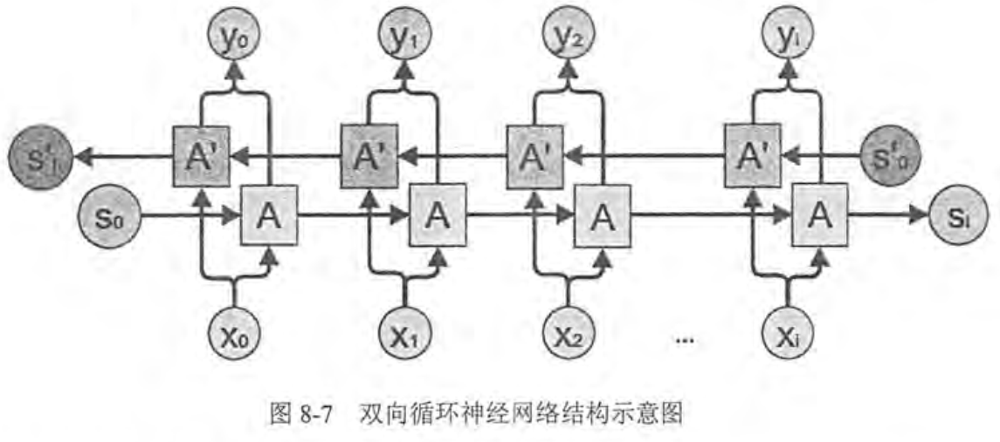

## 1. 双向循环神经网络



* 双向循环神经网络 bidirectional RNN
    1. 当前时刻的输出不仅和之前的状态有关系，也和之后的状态相关
    2. 双向循环神经网络是由两个循环神经网络上下叠加在一起组成的，输出由这两个循环神经网络的状态共同决定

## 2. 深层循环神经网络

1. 深层循环神经网络 deep RNN
    1. 深层循环神经网络在每一个时刻上将循环体结构复制了多次

## 3. MultiRNNCell实现深层循环神经网络的前向传播过程

* 在TensorFlow中只需要在BasicLSTMCell的基础上再封装一层MultiRNNCell就可以实现深层循环神经网络

```py
#定义一个LSTM结构。LSTM中使用的变量也会在该函数中自动声明
lstm = rnn_cell.BasicLSTMCell(lstm_hidden_size)
#通过MultiRNNCell类实现深层循环神经网络中每一个时刻的前向传播过程。number_of_layers表示有多少层
stacked_lstm = rnn_cell.MultiRNNCell([lstm] * number_of_layers)
#将LSTM中的状态初始化为全为0数组，batch_size给出一个batch的大小
state = lstm.zero_state(batch_size, tf.float32)

#定义损失函数
loss=0.0
for i in range(num_steps):
    if i > 0: tf.get_variable_scope().reuse_variables()
    #将当前输入 current_input 和前一时刻状态 state 传入定义的LSTM结构可以得到当前LSTM结构的输出 lstm_output 和更新后的状态 state
    stacked_lstm_output, state = stacked_lstm(current_input, state)
    #将当前时刻LSTM结构的输出传入一个全连接层得到最后的输出
    final_output = fully_connected(stacked_lstm_output)
    #计算当前时刻输出的损失
    loss += calc_loss(final_output, expected_output)
```


