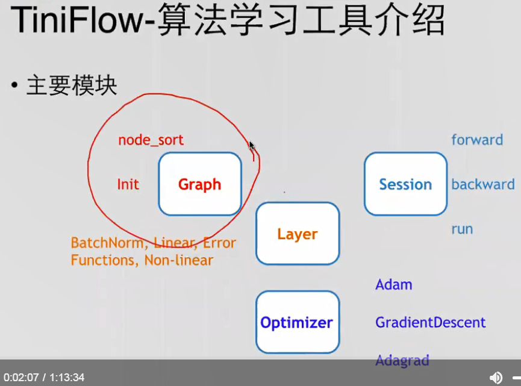

1. Graph
    1. node_sort
    2. Init
2. Session
    1. forward
    2. backward
    3. run拆解成前向和后向
3. Layer
    1. BatchNorm
    2. Linear
    3. Non-liner
    4. Error Functions
4. Optimizer
    1. Adam
    2. GradientDescent
    3. Adagrad
    